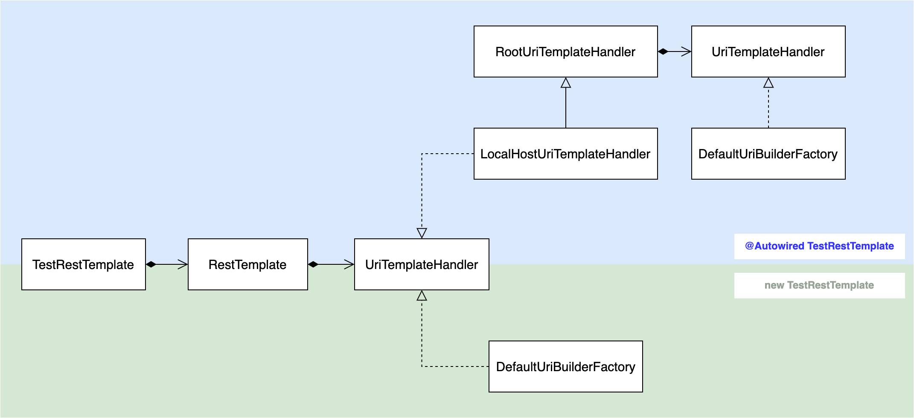

## TL;DR

- `new TestRestTemplate`
    - `rest.getForEntity("/hello", String.class);` -> IllegalArgumentException 발생!
- `@Autowired TestRestTemplate`
    - `rest.getForEntity("/hello", String.class);` -> OK

## 서론

아래와 같은 흐름에 따라 본 포스트가 작성되었다.

1. [토비의 스프링 부트 - 이해와 원리][1] 실습 중 `TestRestTemplate`를 사용하였다. 생성자로 객체를 생성하여 사용하였고, URL은 절대경로를 입력하였다.
2. 강의를 모두 수강한 후, Spring Boot에 대한 이해를 높이기 위해 [공식 Reference][2]를 살펴보다가 `TestRestTemplate`를 사용하는 부분을 확인하였다. `@Autowired`로
   주입받아 사용하였고, URL은 path만 입력하도록 되어 있었다.
3. 강의 실습코드에 `TestRestTemplate`를 사용한 부분으로 실험을 하여 아래의 결과를 얻었다.
    - URL을 path만 입력하도록 변경하였더니 예외가 발생하였다.
    - `TestRestTemplate`를 `@Autowired`로 주입받는 방식으로 변경하였더니 예외가 발생하지 않았다.
4. 직접 생성한 객체와 Spring Boot가 생성하여 주입해주는 객체의 움직임 차이를 명확히 확인하기 위해 [학습 테스트](#학습-테스트---생성-방법에-따른-url-사용-가능-여부-확인)를 작성하였다.
5. 원인 파악을 위해 [소스 코드를 분석](#testresttemplate-코드-분석)하였고, 차이점을 확인하여 내부구현을 확인하는 [학습 테스트](#학습-테스트---내부-구현-확인)를 작성하였다.
6. 생성 방식에 따른 구현 차이에 대한 이해를 돕기위해 [다이어그램](#testresttemplate-의존성-다이어그램)을 작성하였다.

학습 테스트는 [Github Repository][3]에 공개되어 있으며, Spring Boot 3.0.2 버전 기준으로 작성되었다.

## 학습 테스트 - 생성 방법에 따른 URL 사용 가능 여부 확인

### `new TestRestTemplate`

Path 경로 만을 사용 할 경우, **IllegalArgumentException 예외**가 발생하였고, **URI is not absolute** 라는 메세지가 출력된다.

```java
@SpringBootTest(webEnvironment = SpringBootTest.WebEnvironment.DEFINED_PORT)
public class NewTestRestTemplateTest {

    TestRestTemplate rest;

    @BeforeEach
    void init() {
        rest = new TestRestTemplate();
    }

    @Test
    @DisplayName("절대 경로 사용")
    void absoluteURLTest() {
        ResponseEntity<String> res = rest.getForEntity("http://localhost:8080/hello?name={name}", String.class, "Spring");

        assertThat(res.getStatusCode()).isEqualTo(HttpStatus.OK);
        assertThat(res.getHeaders().getFirst(HttpHeaders.CONTENT_TYPE)).startsWith(MediaType.TEXT_PLAIN_VALUE);
        assertThat(res.getBody()).isEqualTo("Spring");
    }

    @Test
    @DisplayName("Path 경로 만으로는 사용 불가능")
    void pathURLTest() {
        assertThatThrownBy(
                () -> rest.getForEntity("/hello?name={name}", String.class, "Spring")
        ).isInstanceOf(IllegalArgumentException.class).hasMessage("URI is not absolute");
    }
}
```

### `@Autowired TestRestTemplate`

하지만 `@Autowired`로 주입받을 경우, Path 경로 만 사용하여도 문제가 없다.

```java
@SpringBootTest(webEnvironment = SpringBootTest.WebEnvironment.DEFINED_PORT)
public class AutowiredTestRestTemplateTest {
    @Autowired
    TestRestTemplate rest;

    @Test
    @DisplayName("절대 경로 사용")
    void absoluteURLTest() {
        ResponseEntity<String> res = rest.getForEntity("http://localhost:8080/hello?name={name}", String.class, "Spring");

        assertThat(res.getStatusCode()).isEqualTo(HttpStatus.OK);
        assertThat(res.getHeaders().getFirst(HttpHeaders.CONTENT_TYPE)).startsWith(MediaType.TEXT_PLAIN_VALUE);
        assertThat(res.getBody()).isEqualTo("Spring");
    }

    @Test
    @DisplayName("Path 경로 만으로도 사용 가능")
    void pathURLTest() {
        ResponseEntity<String> res = rest.getForEntity("/hello?name={name}", String.class, "Spring");

        assertThat(res.getStatusCode()).isEqualTo(HttpStatus.OK);
        assertThat(res.getHeaders().getFirst(HttpHeaders.CONTENT_TYPE)).startsWith(MediaType.TEXT_PLAIN_VALUE);
        assertThat(res.getBody()).isEqualTo("Spring");
    }
}
```

## TestRestTemplate 코드 분석

### 기본 흐름

`TestRestTemplate`는 내부적으로 `RestTemplate`를 가지고 있어, 실제 행위는 `RestTemplate`에게 위임하는 방식으로 동작한다.
`RestTemplate`는 `UriTemplateHandler`를 통해 URI를 확정한다.

### `new TestRestTemplate`

객체를 직접 생성하는 경우, `UriTemplateHandler`의 구현체로 `DefaultUriBuilderFactory`가 사용된다.

```java
// spring-web-6.0.4-sources.jar!/org/springframework/web/client/RestTemplate.java:109
public class RestTemplate extends InterceptingHttpAccessor implements RestOperations {
    ...
    
    private UriTemplateHandler uriTemplateHandler;
    
    ...
    
    public RestTemplate() {
        ...
        
        this.uriTemplateHandler = initUriTemplateHandler();
    }
    
    private static DefaultUriBuilderFactory initUriTemplateHandler() {
        DefaultUriBuilderFactory uriFactory = new DefaultUriBuilderFactory();
        uriFactory.setEncodingMode(EncodingMode.URI_COMPONENT);  // for backwards compatibility..
        return uriFactory;
    }
}
```

`new DefaultUriBuilderFactory()`로 생성될 경우, `expand`메서드를 통해 URI 확정 시, 클라이언트에서 입력한 URL그대로를 사용한다.

```java
// spring-web-6.0.4-sources.jar!/org/springframework/web/util/DefaultUriBuilderFactory.java:42
public class DefaultUriBuilderFactory implements UriBuilderFactory {
    @Nullable
    private final UriComponentsBuilder baseUri;
    
    ...
    
    public DefaultUriBuilderFactory() {
        this.baseUri = null;
    }
    
    ...
    
    @Override
    public URI expand(String uriTemplate, Object... uriVars) {
        return uriString(uriTemplate).build(uriVars);
    }
    
    @Override
    public UriBuilder uriString(String uriTemplate) {
        return new DefaultUriBuilder(uriTemplate);
    }
    
    ...
    
    private class DefaultUriBuilder implements UriBuilder {
        private final UriComponentsBuilder uriComponentsBuilder;
        
        public DefaultUriBuilder(String uriTemplate) {
            this.uriComponentsBuilder = initUriComponentsBuilder(uriTemplate);
        }
        
        private UriComponentsBuilder initUriComponentsBuilder(String uriTemplate) {
            UriComponentsBuilder result;
            if (!StringUtils.hasLength(uriTemplate)) {
                ...
            }
            else if (baseUri != null) {
                ...
            }
            else {
                result = UriComponentsBuilder.fromUriString(uriTemplate);
            }
                
            ...
            
            return result;
        }
        
        ...
        
        @Override
        public URI build(Object... uriVars) {
            ...
            
            UriComponents uric = this.uriComponentsBuilder.build().expand(uriVars);
            return createUri(uric);
        }

        private URI createUri(UriComponents uric) {
            if (encodingMode.equals(EncodingMode.URI_COMPONENT)) {
                uric = uric.encode();
            }
            return URI.create(uric.toString());
        }
    }
}
```

### `@Autowired TestRestTemplate`

Spring Boot가 TestRestTemplate를 빈으로 등록하여 주입하는 경우, `UriTemplateHandler`의 구현체로 `LocalHostUriTemplateHandler`가 사용된다.

```java
// spring-boot-test-3.0.2-sources.jar!/org/springframework/boot/test/web/client/TestRestTemplateContextCustomizer.java:130
public static class TestRestTemplateFactory implements FactoryBean<TestRestTemplate>, ApplicationContextAware {
    ...
    
    private TestRestTemplate template;
    
    @Override
    public void setApplicationContext(ApplicationContext applicationContext) throws BeansException {
        RestTemplateBuilder builder = getRestTemplateBuilder(applicationContext);
        boolean sslEnabled = isSslEnabled(applicationContext);
        TestRestTemplate template = new TestRestTemplate(builder, null, null,
                sslEnabled ? SSL_OPTIONS : DEFAULT_OPTIONS);
        LocalHostUriTemplateHandler handler = new LocalHostUriTemplateHandler(applicationContext.getEnvironment(),
                sslEnabled ? "https" : "http");
        template.setUriTemplateHandler(handler);
        this.template = template;
    }
    
    ...
}
```

`new LocalHostUriTemplateHandler(applicationContext.getEnvironment(), "http")`로 생성될 경우, 
`expand`메서드를 통해 URI 확정 시, 클라이언트에서 입력한 URL이 '/'로 시작 할 경우, rootUri를 추가하여 사용한다.

```java
// spring-boot-3.0.2-sources.jar!/org/springframework/boot/web/client/RootUriTemplateHandler.java:35
public class RootUriTemplateHandler implements UriTemplateHandler {
    ...
    
    @Override
    public URI expand(String uriTemplate, Object... uriVariables) {
        return this.handler.expand(apply(uriTemplate), uriVariables);
    }
    
    private String apply(String uriTemplate) {
        if (StringUtils.startsWithIgnoreCase(uriTemplate, "/")) {
            return getRootUri() + uriTemplate;
        }
        return uriTemplate;
    }
}

// spring-boot-test-3.0.2-sources.jar!/org/springframework/boot/test/web/client/LocalHostUriTemplateHandler.java:35
public class LocalHostUriTemplateHandler extends RootUriTemplateHandler {
    ...
    
    @Override
    public String getRootUri() {
        String port = this.environment.getProperty("local.server.port", "8080");
        String contextPath = this.environment.getProperty(PREFIX + "context-path", "");
        return this.scheme + "://localhost:" + port + contextPath;
    }
}
```

### TestRestTemplate 의존성 다이어그램



## 학습 테스트 - 내부 구현 확인

TestRestTemplate가 사용하는 rootUri와 uri를 해결하는 Handler의 구현체가 상이함을 테스트로 확인하였다.

```java
@SpringBootTest(webEnvironment = SpringBootTest.WebEnvironment.DEFINED_PORT)
public class TestRestTemplateInitTest {
    @Test
    void checkAutowired(@Autowired TestRestTemplate rest) {
        String rootUri = rest.getRootUri();
        assertThat(rootUri).isEqualTo("http://localhost:8080");

        UriTemplateHandler uriTemplateHandler = rest.getRestTemplate().getUriTemplateHandler();
        assertThat(uriTemplateHandler).isInstanceOf(LocalHostUriTemplateHandler.class);
    }

    @Test
    void checkNew() {
        TestRestTemplate rest = new TestRestTemplate();

        String rootUri = rest.getRootUri();
        assertThat(rootUri).isEqualTo("");

        UriTemplateHandler uriTemplateHandler = rest.getRestTemplate().getUriTemplateHandler();
        assertThat(uriTemplateHandler).isInstanceOf(DefaultUriBuilderFactory.class);
    }
}
```

## 덧붙이는 말

[토비의 스프링 부트- 이해와 원리][1]에서 스프링 부트의 자동 구성 흐름을 배움으로서 스프링 내부 코드를 읽는 것이 조금은 수월해 졌음을 느꼈다. 스프링 부트의 자동구성 마법을 쉽고 빠르게 이해하고 싶다면 강추한다.

## ref.

- [토비의 스프링 부트 - 이해와 원리][1]
- [Spring Boot Reference Documentation - Testing With a Running Server][2]
- [학습 테스트 Github Repository][3]

[1]: <https://www.inflearn.com/course/토비-스프링부트-이해와원리> "토비의 스프링 부트 - 이해와 원리"
[2]: <https://docs.spring.io/spring-boot/docs/current/reference/htmlsingle/#features.testing.spring-boot-applications.with-running-server> "Spring Boot Reference Documentation - Testing With a Running Server"
[3]: <https://github.com/seungyeop-lee/study-test/tree/main/framework/spring/test/testRestTemplate> "study-test TestRestTemplate"
