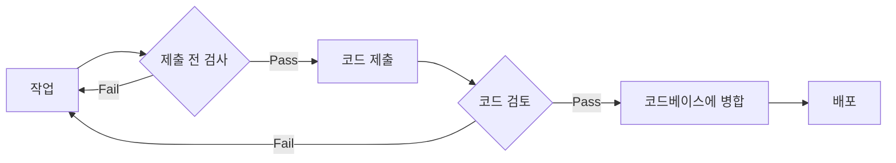
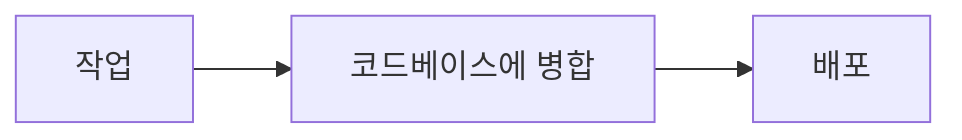

# 1. 코드 품질

작가는 고품질 코드가 신뢰 가능하고, 유지보수가 쉬우며, 버그가 적은 소프트웨어를 생산한다고 주장한다.

그림 1.1은 저품질 코드를 중심으로 파악하는게 좋은 것 같다. 왜냐하면, 고품질 코드라 해서 장점으로 이야기하는 사항에 대해 무조건 맞다고 할 수 없지만, 저품질 코드면 이야기한 부분이 대부분 맞기 때문이다.

> 엔지니어들이 코드를 작성할 때 내리는 일상적인 결정은 그것만 보면 작고 때로는 보잘것없어 보일 수 도 있지만, 좋은 소프트웨어인지 그렇지 않은지는 그 모든 작은 결정들이 모여서 이루어진다. [^1]

[^1]: 좋은코드 나쁜코드 5p

## 1.1. 코드는 어떻게 소프트웨어가 되는가

코드가 소프트웨어가 되어가는 일반적인 과정에 대해 서술한다.

개발 및 배포 프로세스에 대해 자세히 설명하는데 그 흐름을 간략히하면 다음와 같다.

하지만 우리 회사의 개발 및 배포 프로세스는 팀 별로 다르지만 보통 아래의 프로세스를 따른다.

## 1.2. 코드 품질의 목표

작가는 아래의 4가지 목표를 코드 품질이 달성해야 하는 목표로 본다. 하지만 코드 그 자체가 달성해야 하는 목표라고 느껴진다.

이어서 이야기되는 부분은 각 목표와 품질과의 상관관계를 메인으로 하는 듯하다.

### 1.2.1. 코드는 작동해야 한다

코드는 문제를 해결하기 위해 작성된다. 버그가 있다는 것은 코드가 제대로 작동하지 않다는 것이고, 곧 문제를 완전히 해결하지 못할 가능성이 있다.
요구 사항의 일부를 충족하더라도 '작동한다'라고 말 할 수 있다.

### 1.2.2. 코드는 작동이 멈추면 안 된다

코드는 고립된 환경에서 홀로 실행되는 것이 아니기에, 주변 상황에 따라 동작을 멈출 수도 있다. 그리고 변화하는 환경에 상관없이 계속 동작하는 코드를 만드는 것은 훨씬 어렵다고 이야기 한다.

### 1.2.3. 코드는 변경된 요구 사항에 적응할 수 있어야 한다

한 번 작성하고 다시는 수정되지 않는 코드는 거의 없다라 이야기한다. 하지만 요구사항이 어떻게 변할지 완벽히 예측하는 것도 불가능하다. 그렇다고 변한다는 사실 자체를 완전히 무시하는 것 역시 아니다.

시나리오 A, B는 완벽한 극단의 상황을 보여준다. 우리는 그 중간 어딘가를 선택해야 한다.
예측 할 수 없어도, 적응력이 높은 코드를 작성하기위한 기법이 있고, 이 책에서 다룰 예정이다.

### 1.2.4. 코드는 이미 존재하는 기능을 중복 구현해서는 안 된다

큰 문제는 작은 하위 문제 여러개로 나눌 수 있다. 그리고 하위 문제들 중 대부분은 누군가 해결한 코드가 있다. (라이브러리) 그러니 다시 만들지 말자.
누군가 그 문제를 해결하지 못해서, 내가 코드를 작성했다면, 반대로 그 코드는 다른 개발자들이 사용하기 쉽도록해야 한다.

## 1.3. 코드 품질의 핵심 요소

여기서 부터 코드 품질을 올리기 위한 구체적 조언이 나온다.
6가지 요소를 이야기하는데, 먼저 이야기하는 것일 수록 더 중요한 것이 아닐까 생각한다.
어떻게 핵심 요소를 달성 할 수 있을 지에 대한 간단한 이야기정도가 소개된다.

### 1.3.1. 코드는 읽기 쉬워야 한다

코드의 가독성에 대해 요리 레시피를 예로들어 설명한다. 난 이 레시피를 다 읽는걸 포기했다.
가독성 높은 코드를 위한 4가지 사항을 이야기한다. 각 사항을 함수로 비유하면 아래와 같을 것이다.

- 코드가 하는 일: 함수명
- 어떻게 그 일을 수행하는지: 함수 내용
- (입력이나 상태 등) 어떤 것을 필요로 하는지: 함수 파라미터
- 코드 실행 결과물: 함수 반환 값

### 1.3.2. 코드는 예측 가능해야 한다

이것도 코드의 가독성에 대한 이야기라 생각한다.
전화 주문 에피소드를 통해 예측가능성이 얼마나 중요한지를 역설한다.
정신 모델(mental model)에 대한 이야기도 한다.
개발자가 코드를 읽을때는 정신 모델을 구축하면서 추상화하여 전체적인 맥락을 파악한다는게 핵심이다.
반대로 이야기하면 정신 모델 구축에 방해하는 방식으로 코드가 쓰여있지 코드의 파악이 어렵다.

### 1.3.3. 코드를 오용하기 어렵게 만들라

소켓의 모양이 다름에 따라 오용이 힘든 사례를 든다.
코드의 오용이 쉬우면 버그는 물론 데이터의 손실까지도 불러올 수 있다고 이야기한다.

### 1.3.4. 코드를 모듈화하라

이번에는 장난감 인형으로 예시를 든다.
모듈화가 잘 되어 있으면 인터페이스가 잘 정의되어 서로 다른 구성 요소 간 상호작용하는 지점이 최소화된다고 한다.

### 1.3.5. 코드를 재사용 가능하고 일반화할 수 있게 작성하라

재사용성과 일반화성에 대한 정의를 먼저 이야기한다. 그리고 코드베이스가 적은게 좋다는 이야기도 같이한다.
코드베이스가 적으려면 다른 사람들이 만든 테스트 잘되고 검증된 코드를 적극적으로 사용해야 한다.

### 1.3.6. 테스트가 용이한 코드를 작성하고 제대로 테스트하라

테스트의 중요성을 이야기한다. 그리고 테스트와 테스트 용이성에 대해 이야기한다.

## 1.4. 고품질 코드 작성을 일정을 지연시키는가?

역시 단기적으로는 고품질 코드가 시간이 더 걸릴 수 있다고 이야기한다.
한번 사용하고 버릴 유틸성 프로그램이라면 고품질 코드에 연연할 필요가 없다.
왜 고품질 코드가 장기적으로 시간을 단축시켜 줄 수 있는지에 대한 이야기를 선반 설치 이야기를 통해 간접적으로 이야기한다.

## 이야기 해볼 것

- 고품질 코드가 이렇게 중요하다 하는데, SI나 우리가 하는 프로그래밍에서는 왜 아무도 고품질 코드를 위한 활동을 하지 않는것인가?
- 책에서 이야기하는 개발 및 배포 프로세스에 비해 지금 우리의 개발 프로세스가 단순한 이유는 무엇일까?
