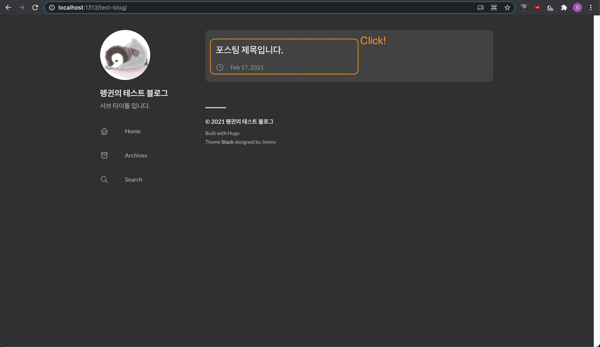
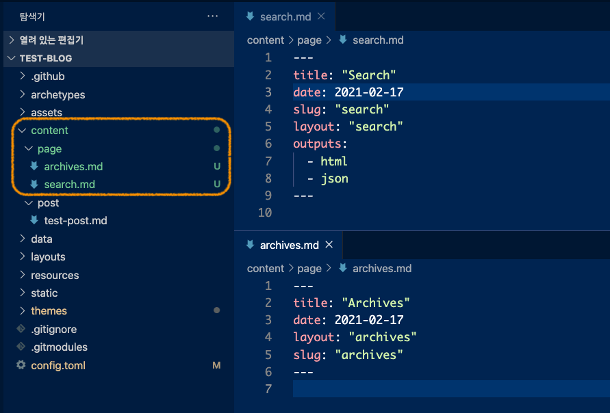

[목차](../index) / [이전글](../3)

## 포스팅 작성

### 포스팅 경로 설정

hugo에서 모든 컨텐츠는 content 폴더 하부에 위치하게 됩니다. 포스팅을 하기 전, 포스팅 폴더 설정을 하겠습니다.

- config.toml 파일에 아래의 내용을 추가합니다.

```toml
# content/post폴더 접근 path를 설정합니다.
[permalinks]
post = "/p/:slug/"

# 포스팅 문서가 모여있는 루트 폴더를 설정합니다.
[params]
mainSections = ["post"]
```

### 포스팅 작성

- content 하부에 post 폴더를 생성합니다.
- post 폴더에 포스팅 할 파일을 마크다운 형식으로 작성합니다.

`test-post.md`
```markdown
---
title: "포스팅 제목입니다."
date: 2021-02-17
draft: false
---

## 포스팅 서브제목입니다.

내용입니다.

```


- `hugo server`를 통해 작성된 포스팅을 확인합니다.




### Archives와 Search 페이지 추가

메뉴에 추가했던 Archives와 Search의 페이지를 추가합니다.

- config.toml 파일의 permalinks에 page를 추가합니다.

```diff
  [permalinks]
  post = "/p/:slug/"
+ page = "/:slug/"
```

- content 하부에 page 폴더를 생성합니다.
- page 폴더에 아래의 파일을 추가합니다.

`archives.md`
```markdown
---
title: "Archives"
date: 2021-02-17
layout: "archives"
slug: "archives"
---

```

`search.md`
```markdown
---
title: "Search"
date: 2021-02-17
slug: "search"
layout: "search"
outputs:
  - html
  - json
---

```



- `hugo server`를 통해 archives와 search 페이지를 확인합니다.


[목차](../index)
