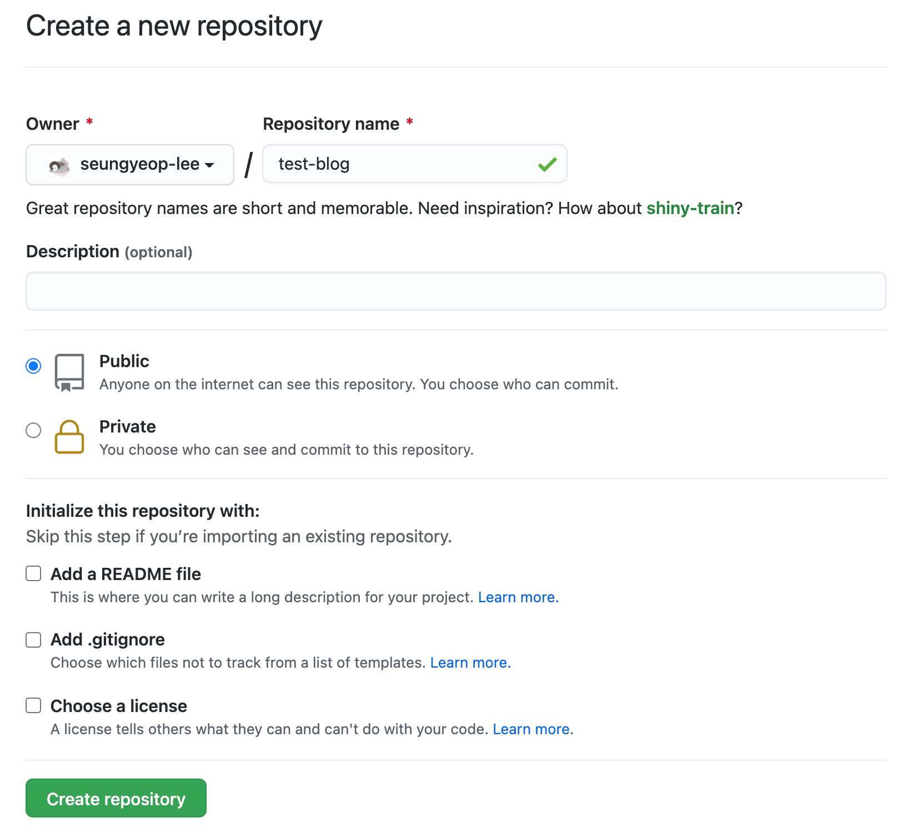
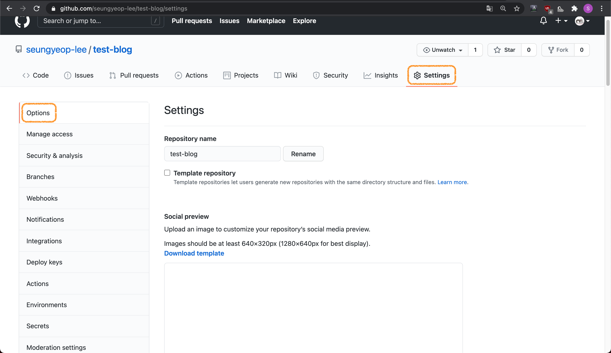

## 목표

- 블로그 진입점을 github pages의 루트가 아닌, 서브 path로 한다.
  - ex. `https://seungyeop-lee.github.io/test-blog/`
- 하나의 repository에서 hugo의 소스파일과 생성된 html을 전부 관리한다.
- github actions를 이용하여 push 할 경우, 자동으로 배포가 되게 한다.
- utterances를 사용하여 댓글도 같은 레포지토리에서 관리한다.

## 실습전 확인 사항

### 주의

시간이 지남에 따라 내용이 정확하지 않을 수 있습니다. 화면이나 움직임이 다를경우 공식 문서를 참고해주세요.

- [hugo](https://gohugo.io/documentation/)
- [github pages](https://docs.github.com/en/github/working-with-github-pages)
- [utterances](https://utteranc.es/)

### 전제 조건

- git 설치
- github 계정 준비

### 실습 환경

- macOS 환경
- brew, vscode 사용

## 로컬에서 블로그 만들기

### hugo 설치하기

1. brew를 이용하여 hugo를 설치한다.

```bash
$ brew install hugo
```

2. hugo의 버전을 확인하여 잘 설치되었는지 확인한다.

```bash
$ hugo version
```

### 블로그 만들기

1. hugo를 이용하여 블로그를 만든다.
   - 블로그의 이름으로 폴더가 만들어진다.

```bash
$ hugo new site test-blog
# test-blog 폴더가 생성된다.
```

### 테마 추가하기

이번 포스팅에서는 [Stack](https://themes.gohugo.io/hugo-theme-stack/) 테마를 사용한다. 다른 테마들은 [여기](https://themes.gohugo.io/)에서 찾아볼 수 있다.

1. 만들어진 폴더로 이동한다.

```bash
$ cd test-blog
```

2. git 저장소를 초기화 한다.

```bash
$ git init
```

3. Stack 테마를 [서브모듈](https://git-scm.com/book/ko/v2/Git-%EB%8F%84%EA%B5%AC-%EC%84%9C%EB%B8%8C%EB%AA%A8%EB%93%88)로 추가한다.

```bash
$ git submodule add https://github.com/CaiJimmy/hugo-theme-stack/ themes/hugo-theme-stack
```

4. vscode를 실행시킨다.

```bash
$ code .
```

5. config.toml 파일에 아래의 코드를 추가한다.

```toml
theme = "hugo-theme-stack"

[params.defaultImage.opengraph]
enabled = false
```

6. 블로그를 로컬에서 가동 시킨다.

```bash
$ hugo server
```

7. 웹브라우저를 이용하여 http://localhost:1313/ 로 접속해본다.
   - 블로그 가동 시 나오는 주소이다. 
    
     `Web Server is available at http://localhost:1313/ (bind address 127.0.0.1)`

   - `control + C`를 누르면 기동이 중지된다.


## github pages를 이용하여 배포하기

### github repository 만들기

1. Repositories 탭에서 New 버튼을 누른다.


2. Repository name을 블로그 이름과 같게하고 Create repository 버튼을 누른다.



3. 로컬에 만들어 놓은 블로그에 지금 만든 repository를 연결한다.
   - 만든 repository의 https에 쓰여있는 주소를 이용한다.


```bash
$ cd test-blog
$ git remote add origin https://github.com/seungyeop-lee/test-blog.git
```

### 자동배포 설정하기

[GitHub Pages action](https://github.com/marketplace/actions/github-pages-action)과 [Hugo setup](https://github.com/marketplace/actions/hugo-setup)를 이용한다.

1. 로컬에 만들어 놓은 블로그 폴더에 github actions 파일을 만든다.
   - ex. `.github/workflows/gh-pages.yml`
2. github actions 파일에 아래의 코드를 추가한다.

```yaml
name: github pages

on:
  push:
    branches:
      - main # Set a branch to deploy

jobs:
  deploy:
    runs-on: ubuntu-18.04
    steps:
      - uses: actions/checkout@v2
        with:
          submodules: true # Fetch Hugo themes (true OR recursive)
          fetch-depth: 0 # Fetch all history for .GitInfo and .Lastmod

      - name: Setup Hugo
        uses: peaceiris/actions-hugo@v2
        with:
          hugo-version: '0.80.0'
          extended: true

      - name: Build
        run: hugo --minify

      - name: Deploy
        uses: peaceiris/actions-gh-pages@v3
        with:
          github_token: ${{ secrets.GITHUB_TOKEN }}
          publish_dir: ./public
```


### github pages 배포하기

1. 만들어놓은 github repository에 push합니다.

```bash
$ cd test-blog
$ git add --all
$ git commit -m "first commit"
$ git branch -M main
$ git push -u origin main
```

2. github repository의 Actions 탭으로 이동하여 자동 배포가 완료되었는지 확인합니다.


3. Settings 탭의 Options로 이동합니다.



4. GitHub Pages > Source에 아래와 같이 설정 후 Save 버튼을 누릅니다.
   - Branch: gh-pages
   - / (root)


5. GitHub Pages로 다시 가보면 github pages의 주소가 보입니다.


6. 접속해보면 배포된 블로그가 보입니다.


### baseURL 수정하기

baseURL 수정이 되지 않아 css 및 js 파일이 제대로 적용되지 않은 문제를 해결합니다.

1. 블로그 폴더의 `config.toml`파일의 `baseURL`을 생성된 github pages 주소로 변경합니다.

```toml
baseURL = "https://seungyeop-lee.github.io/test-blog/"
```

2. github repository에 push하여 반영합니다.

```bash
$ cd test-blog
$ git add --all
$ git commit -m "change baseURL"
$ git push
```

3. github repository의 Actions 탭에서 자동 배포가 완료되었는지 확인합니다.

4. 배포된 블로그로 이동하여 확인합니다.


## 블로그 꾸미기

## utterances로 댓글기능 추가하기
