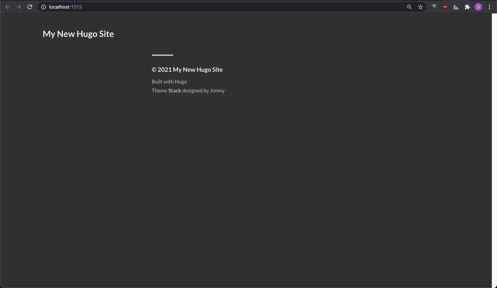

[목차](../index/)

## 로컬에서 블로그 만들기

### hugo 설치하기

1. brew를 이용하여 hugo를 설치합니다.

```bash
$ brew install hugo
```

2. hugo의 버전을 확인하여 잘 설치되었는지 확인합니다.

```bash
$ hugo version
```

### 블로그 만들기

1. hugo를 이용하여 블로그를 만듭니다.
   - 블로그의 이름으로 폴더가 만들어집니다.

```bash
$ hugo new site test-blog
# test-blog 폴더가 생성된다.
```

### 테마 추가하기

이번 포스팅에서는 [Stack](https://themes.gohugo.io/hugo-theme-stack/) 테마를 사용합니다. 다른 테마들은 [Hugo Themes](https://themes.gohugo.io/)에서 찾아볼 수 있습니다.

1. 만들어진 폴더로 이동합니다.

```bash
$ cd test-blog
```

2. git 저장소를 초기화 합니다.

```bash
$ git init
```

3. Stack 테마를 [서브모듈](https://git-scm.com/book/ko/v2/Git-%EB%8F%84%EA%B5%AC-%EC%84%9C%EB%B8%8C%EB%AA%A8%EB%93%88)로 추가합니다.

```bash
$ git submodule add https://github.com/CaiJimmy/hugo-theme-stack/ themes/hugo-theme-stack
```

4. vscode를 실행시킵니다.

```bash
$ code .
```

5. config.toml 파일에 아래의 코드를 추가합니다.

```toml
theme = "hugo-theme-stack"

[params.defaultImage.opengraph]
enabled = false
```

6. 블로그를 로컬에서 가동 시킵니다.

```bash
$ hugo server
```

7. 웹브라우저를 이용하여 http://localhost:1313/ 로 접속해봅니다.
   - 블로그 가동 시 나오는 주소입니다.
    
     `Web Server is available at http://localhost:1313/ (bind address 127.0.0.1)`

   - `control + C`를 누르면 기동이 중지됩니다.



[목차](../index/) / [다음글](../2)
