[목차](../index/) / [이전글](../1)

## github pages를 이용하여 배포하기

### github repository 만들기

1. Repositories 탭에서 New 버튼을 누릅니다.

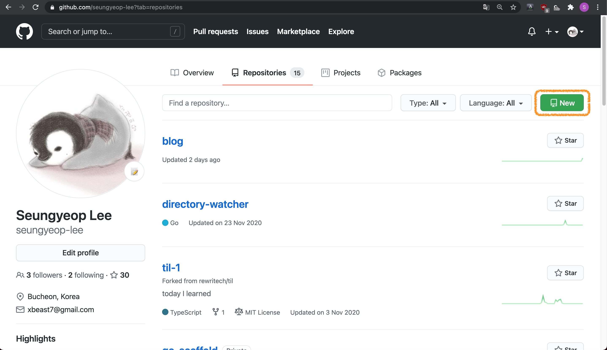

2. Repository name을 블로그 이름과 같게하고 Create repository 버튼을 누릅니다.

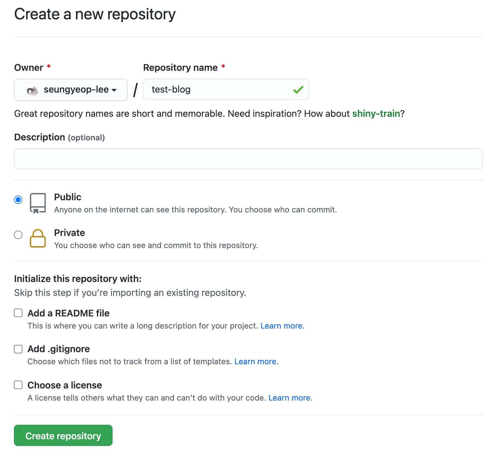

3. 로컬에 만들어 놓은 블로그에 지금 만든 repository를 연결합니다.
   - 만든 repository의 https에 쓰여있는 주소를 이용합니다.

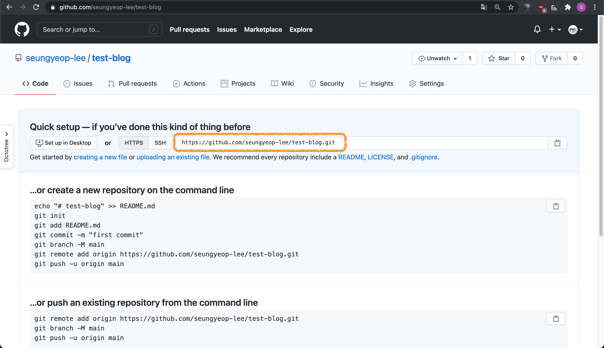

```bash
$ cd test-blog
$ git remote add origin https://github.com/seungyeop-lee/test-blog.git
```

### 자동배포 설정하기

[GitHub Pages action](https://github.com/marketplace/actions/github-pages-action)과 [Hugo setup](https://github.com/marketplace/actions/hugo-setup)를 이용한다.

1. 로컬에 만들어 놓은 블로그 폴더에 github actions 파일을 만듭니다.
   - ex. `.github/workflows/gh-pages.yml`
2. github actions 파일에 아래의 코드를 추가합니다.

```yaml
name: github pages

on:
  push:
    branches:
      - main # Set a branch to deploy

jobs:
  deploy:
    runs-on: ubuntu-18.04
    steps:
      - uses: actions/checkout@v2
        with:
          submodules: true # Fetch Hugo themes (true OR recursive)
          fetch-depth: 0 # Fetch all history for .GitInfo and .Lastmod

      - name: Setup Hugo
        uses: peaceiris/actions-hugo@v2
        with:
          hugo-version: '0.80.0'
          extended: true

      - name: Build
        run: hugo --minify

      - name: Deploy
        uses: peaceiris/actions-gh-pages@v3
        with:
          github_token: ${{ secrets.GITHUB_TOKEN }}
          publish_dir: ./public
```

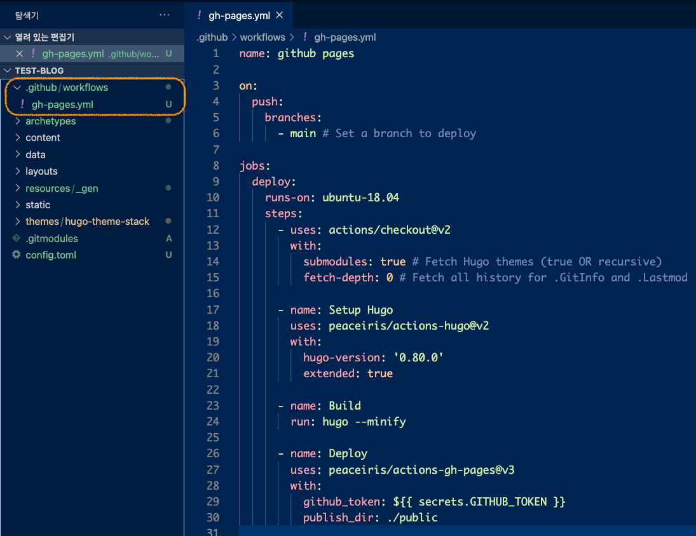

### github pages 배포하기

1. 만들어놓은 github repository에 push합니다.

```bash
$ cd test-blog
$ git add --all
$ git commit -m "first commit"
$ git branch -M main
$ git push -u origin main
```

2. github repository의 Actions 탭으로 이동하여 자동 배포가 완료되었는지 확인합니다.

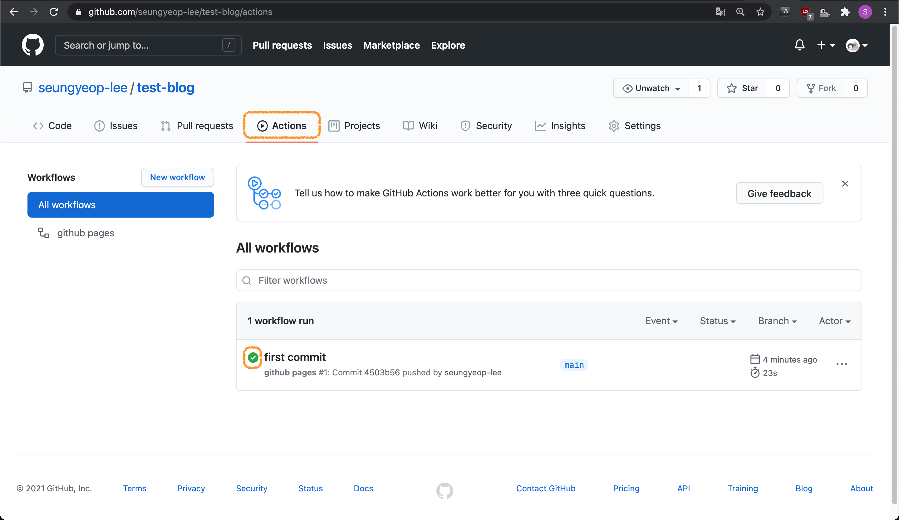

3. Settings 탭의 Options로 이동합니다.

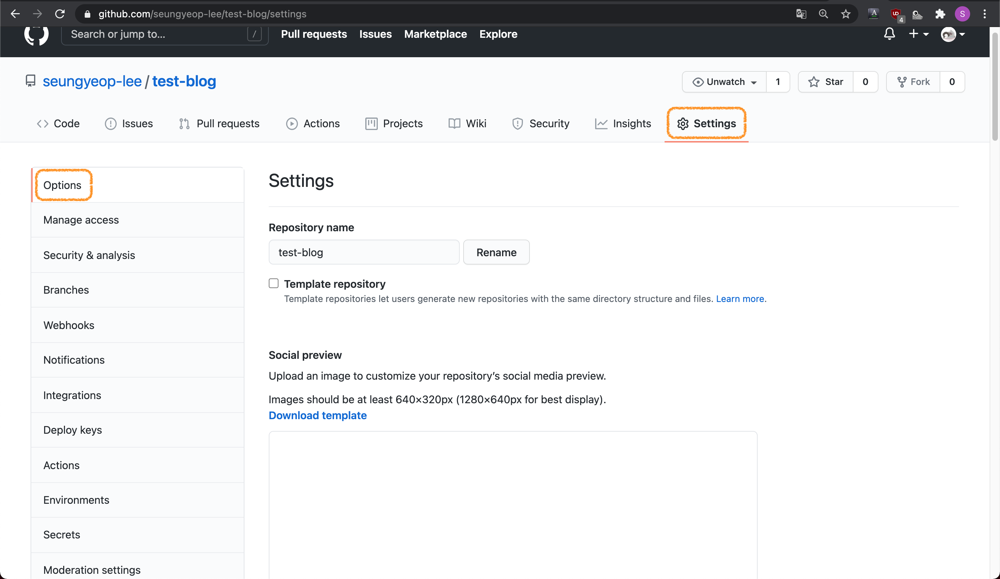

4. GitHub Pages > Source에 아래와 같이 설정 후 Save 버튼을 누릅니다.
   - Branch: gh-pages
   - / (root)

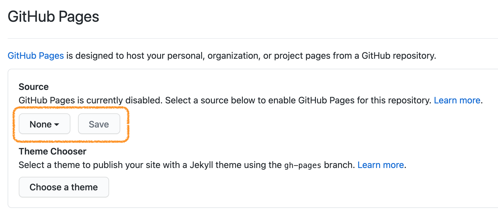

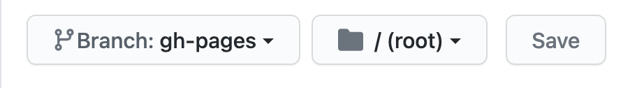

5. GitHub Pages로 다시 가보면 github pages의 주소가 보입니다.

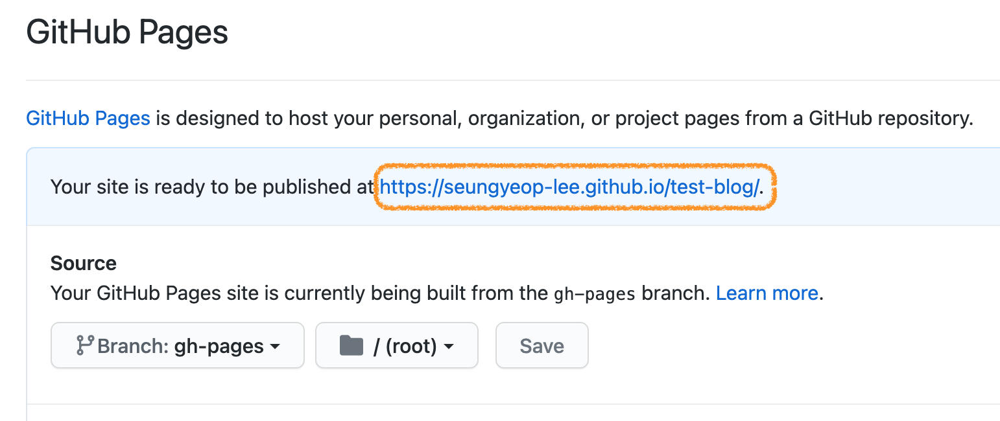

6. 접속해보면 배포된 블로그가 보입니다.

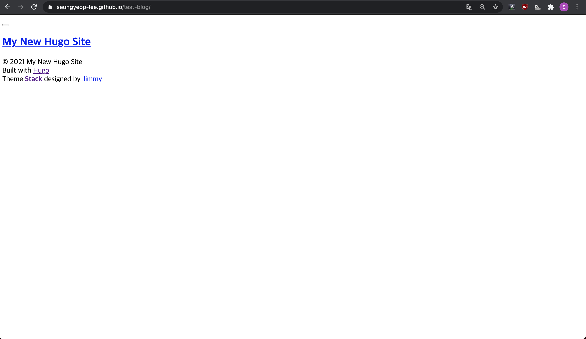

### baseURL 수정하기

baseURL 수정이 되지 않아 css 및 js 파일이 제대로 적용되지 않은 문제를 해결합니다.

1. 블로그 폴더의 `config.toml`파일의 `baseURL`을 생성된 github pages 주소로 변경합니다.

```toml
baseURL = "https://seungyeop-lee.github.io/test-blog/"
```

2. github repository에 push하여 반영합니다.

```bash
$ cd test-blog
$ git add --all
$ git commit -m "change baseURL"
$ git push
```

3. github repository의 Actions 탭에서 자동 배포가 완료되었는지 확인합니다.

4. 배포된 블로그로 이동하여 확인합니다.

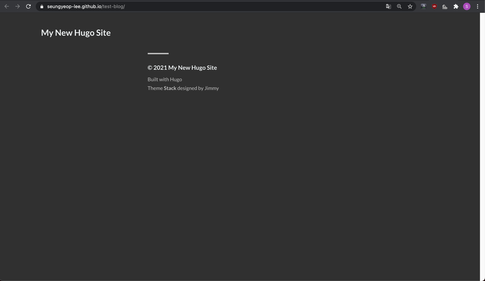

[목차](../index/) / [다음글](../3)
