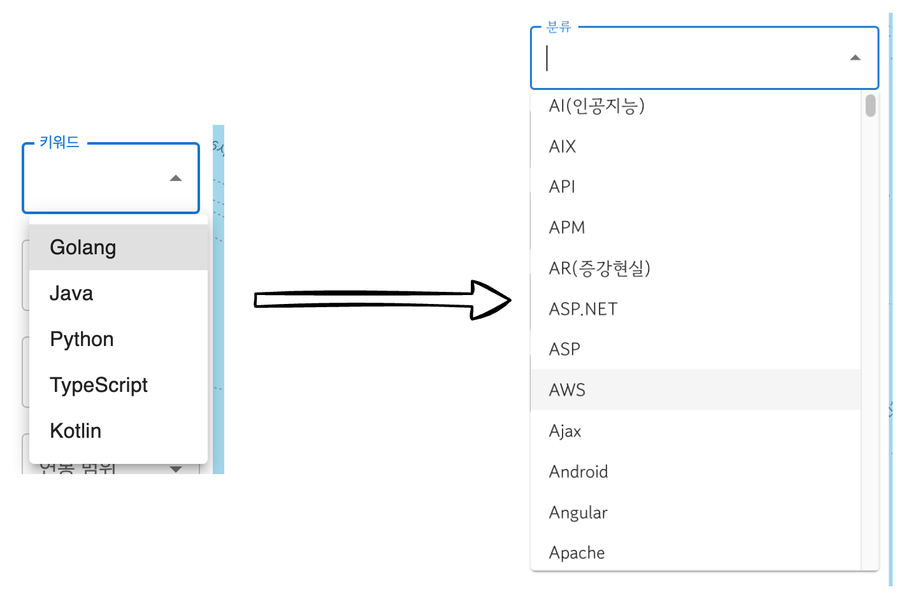
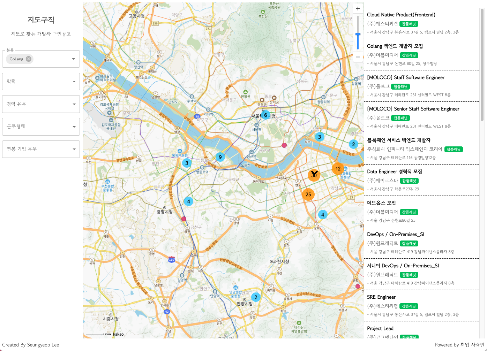
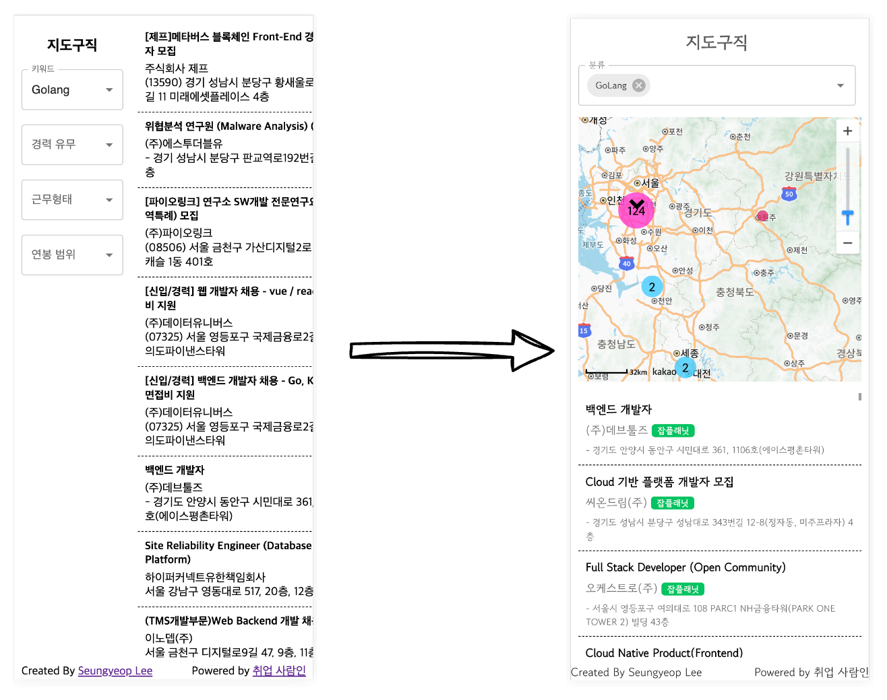
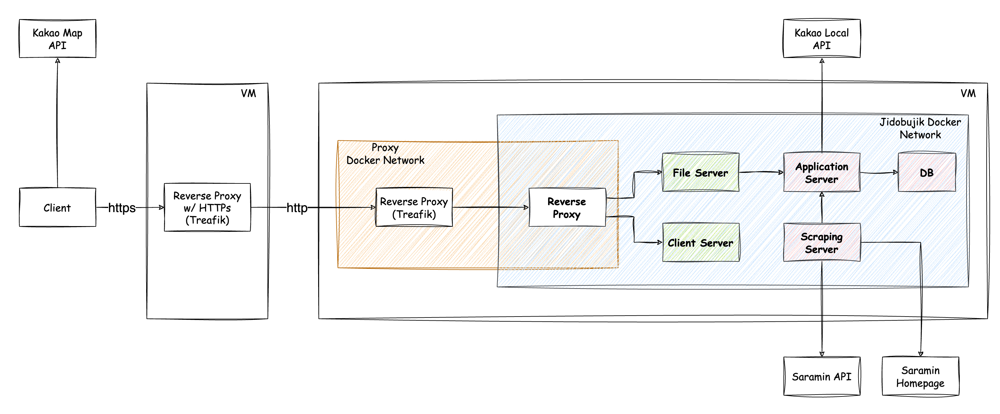

재취업을 준비하던 시기에 만들었던 [지도구직](https://jidogujik.seungyeop-lee.com)을 9월 중순부터 틈틈히 개선하는 작업을 해왔다.
개선 목표를 어느정도 달성했다고 생각되어 지금까지의 개선작업을 되돌아보기 위해 글을 남긴다.

## 기능 개선 목표

개선 작업에 들어가면서 목표했던 것들은 아래와 같다.

- 검색조건 확대
- 디자인 개편
- 모바일 브라우저 대응

## 검색조건 확대

기존에는 프로그래밍 언어 5개를 키워드로 해서 검색한 결과로 데이터를 제공하였으나, 좀 더 다양한 조건으로 검색하고 싶다는 피드백을 많이 받았다.
그래서 사람인의 'IT개발·데이터' 직무의 하위 직무에 대해 직무별 데이터를 제공하는 것으로 변경하였다. 그에 더해, 선택개수가 많아진 만큼 Autocomplete과 multiselect를 도입하였다.

시스템적으로 가장 큰 개선이어서, 개선 전에 프로젝트의 전반적인 리팩토링을 거치고 기능 추가작업을 진행하였다.

## 디자인 개편

폰트 변경, 마커 스타일 변경, 재정렬 등을 했지만, 사실 티가 잘 나지 않는다...

## 모바일 브라우저 대응

처음 만들때는 최소 기능 구현을 목표로 삼아서 모바일 대응은 전혀 염두해 두지 않았다. 하지만 주변에서 휴대폰에서 볼 수 있으면 좋겠다는 피드백을 많이 받아서 고려하게되었다.

사실 CSS와 그리 친하지 않아서, 차일피일 미루고 있다가 [Tailwinds CSS](https://tailwindcss.com/)에 대해 좋은 평가를 해주시는 개발자 지인분의 이야기를 듣고 공부해보니 너무 편해서 실습겸 적용하게 되었다.

## 그 외 개선사항

### 자잘한 기능 개선

- **검색조건에 '학력' 추가**: 고졸 개발자한테는 학력도 중요한 필터링 요건이라는 피드백을 듣고 추가하였다.
- **잡플레닛 검색 링크 추가**: 잡플레닛의 평점도 회사를 결정하는 중요 요인이므로, 잡플레닛 검색을 편히 할 수 있게 링크를 추가하였다.

### Vite -> Next.js

- 추후 확장이나 관리 측면에서의 편의성을 생각해서 Next.js로 마이그레이션 하였다.

### Caddy -> Traefik, K8s -> Docker

 
- Caddy를 걷어내고 전부 Traefik으로 변경하였다. 편한 설정으로 https를 적용해주는 것 까지는 좋았지만, 나머지 부분은 전부 Traefik보다 못해서, 결국은 교체하였다.
- 로컬 개발 환경은 docker compose로, 운영 환경은 K8s로 이원화해서 사용하였으나, 트래픽도 거의 없고, 무중단 배포 등에 목맬 필요가 없는 프로젝트라고 생각해서 관리 편의상 운영 환경도 docker compose로 마이그레이션하였다.
  - 현재 회사에서는 K8s는 고사하고, Docker도 사용하지 않던 곳이라 k8s에 대한 지식이 잊혀짐에 따라 K8s로 운영하기 점점 힘들어지는 것도 컸다.

### DB 백업

- [docker-volume-backup](https://github.com/offen/docker-volume-backup)을 이용해서 DB Data Volume을 하루에 한번 백업을 수행한다.

## 소감

일하면서 틈틈이 마음이 동할 때 조금씩 고쳐나간 것이 어느정도 완성된 것을 보니 이제야 '어디에 좀 내놓을 수 있는 서비스가 되었구나'란 생각이 들었다.

근무지 주소 정보를 사람인 사이트에서 스크래핑하는 부분도 있다보니 언제 블락당할지 몰라서 많이 정을 많이 주지 않은 것도 사실이다. 그리고 그 위험은 여전히 존재한다.

그래도 뭔가를 배워서 회사가 아닌 곳에 사용 할 수 있는 곳이 있다는게 참 좋았고, 좀 더 완성도있는 서비스를 만들었다는 생각에 뿌듯했다.

개인화 기능과 검색 엔진을 통해 더 지능화된 검색을 지원하는 등 아이디어는 많은데 언제 또 작업할지는 모르겠다. 마음이 동할때, 그리고 해당 기술을 배우고 적용하고 싶을 때, 다시 시작해보련다.
