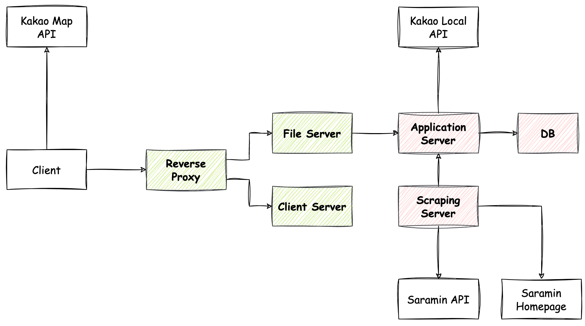
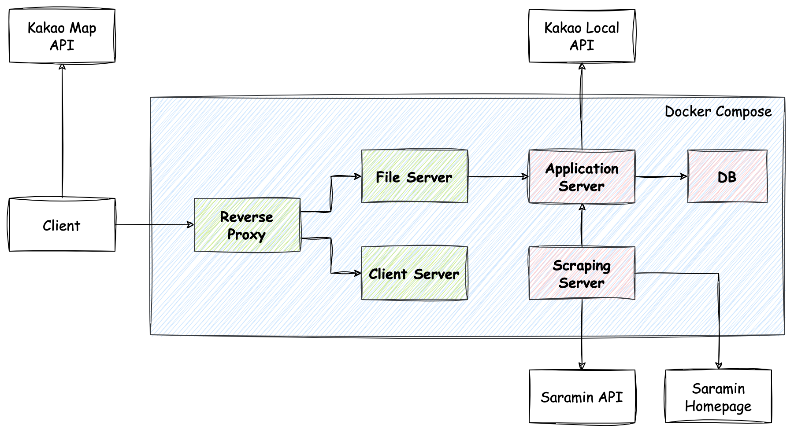
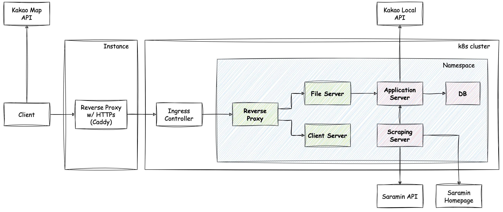

> ## 2024. 03. 13 추가
>
> 2024년 2월 17일 이후로 서버의 IP가 사람인 쪽 블랙리스트에 올라간듯하다. 우려했던 상황이 벌어진 것이다.
>
> IP를 바꿔가며 서비스를 지속 할 수도 있지만, 사람인 쪽에서 부정행위로 인식한 이상 그만 두는 것이 맞는 것 같다.
>
> 그래서 오늘부로 서비스를 종료한다.

근무지 및 회사 주소를 기반으로 개발자 구인공고를 지도에서 확인 할 수 있는 서비스(가칭 '지도구직')를 런칭하였다!

지도구직은 [http://jidogujik.seungyeop-lee.com](http://jidogujik.seungyeop-lee.com) 에서 확인 할 수 있다.

예정대로라면 소스코드 전체를 오픈하고, 저장소의 README에 자세한 내용을 기재하였을 것이다.
하지만 서비스 특성과 이 서비스를 만들 때 세운 원칙으로 인한 코드 퀄리티 낮음 등의 이유로 오픈하지 않으려 한다.

이 서비스를 만들게 된 계기부터 구성, 과정, 보완해야 될 점 등을 정리한다.

## 계기

1. 채용사이트에서 회사의 자세한 위치로 공고를 검색할 수있는 기능을 제공하지 않는다.
2. 나는 통근시간이 매우 중요함으로, 지도기반의 공고검색 서비스가 매우 필요하다.
3. 내가 만든다면 포트폴리오로 사용 할 수 있고, 내가 넓은 영역에 역량이 있다는 것을 직접적으로 증명 할 수 있다.
4. 만들자!

## 목표와 원칙

본 서비스를 만들기 전에 한가지 큰 목표를 세웠다.

- 가치를 줄 수 있고, 지속 가능한 최소기능의 결과물을 최대한 빨리 만들어낸다.

목표를 달성하기 위해 몇 가지 원칙을 가지고 작업을 시작하였다.

- 최소기능으로 만들자
- 구조보다는 기능구현에 초점을 맞추자
- 유지보수가 가능한 수준의 코드 퀄리티는 유지하자
- 지속 가능하도록 설계하자
- 내가 사용 가능한 기술들을 최대한 이용하자

릴리즈까지 최대한 원칙을 준수하고자 노력한 결과, 구현시작 4일만에 릴리즈에 성공 할 수 있었다.

## 구성

### 기본 구성

- File Server
  - 화면을 구성하기 위한 데이터를 json 파일 형태로 저장하여 서빙해주는 서버
  - 매 시간마다 Application Server에서 데이터를 가지고 와서 서빙 할 파일을 갱신한다.
- Application Server
  - 채용공고 데이터를 관리하는 서버
  - 주소만 있는 채용공고의 경우 Kakao Local API를 이용하여 위경도 정보를 보강한다.
- Scraping Sever
  - 사람인 API 및 사람인 페이지를 스크래핑하는 서버
  - 매일 새벽마다 Application Server에 저장된 데이터와 API가 제공해주는 데이터를 비교하여 선별적으로 사람인 홈페이지를 스크래핑한다.

### 환경 구성

배포 시 설정문제를 최대한 줄이고자, 로컬 개발 환경과 배포 환경을 최대한 동일하게 맞출 수 있는 구성으로 설계하였다.

파란색 부분이 배포 대상이 되는 부분이다.

## 사용 기술

### 백엔드

- Scraping Server: Go, Echo
- Application Server: Java, Spring Boot, JPA, retrofit
- Application DB: MariaDB
- File Server: Go, Echo

### 프론트엔드

- Client Server: Nginx
- Client: Typescript, React, Axios, MUI, Zustand, react-kakao-maps-sdk

### 인프라

- Reverse Proxy: Nginx
- 로컬 개발 환경: Docker Compose
- 배포 환경: Kubernetes

## 개발 일지

아이디어를 내고, 런칭까지 1주일이 소요되었고, 실제 구현에는 4일이 소요되었다.

### 2023.02.08

- 공고를 확인하다가 아이디어가 떠오름
- 사람인 홈페이지 및 사람인 API 분석을 통한 가능성 확인 및 전략 수립
- 사람인 API 사용 요청

### 2023.02.09

- 사람인 API 승인이 나지 않아서 진행하지 못함

### 2023.02.10

- 사람인 API 승인이 오후가 되도 나지않아서, 문의메일을 보냈음. 바로 승인완료 이메일이 옴
- 사람인 API와 사람인 홈페이지 스크래핑을 코드로 PoC

### 2023.02.11

- 전체 구성 설계 초안 작성
- 데이터 모델링 초안 작성
- Scraping Server 작성

### 2023.02.12

- 로컬 개발 환경 셋팅 ([local-dev-environment-based-on-docker 기반](https://github.com/seungyeop-lee/local-dev-environment-based-on-docker))
- Kakao Local API PoC
- Application Server 작성
- Scraping Server 보강
- 구성 설계 및 데이터 모델링 수정

### 2023.02.13

- File Server 작성
- Client Layout 작성 및 Kakao Map API PoC
- Application Server, Scraping Server 보강

### 2023.02.14

- Client 작성
- Application Server, Scraping Server, File Server 보강
- 배포 환경 구축
- 릴리즈

## 보완이 필요한 부분

- Client UI/UX
  - 모바일용 UI 설계 및 적용 (세로모드)
  - 지도의 정보가 없는 부분을 클릭(터치)시 표시되있던 리스트가 보이지 않도록 변경
- Scraping Server
  - 현재는 하나의 키워드에 대해 모든 스크래핑이 끝나야 Application Server로 결과 데이터를 전송하고 있고, 에러 처리가 미흡하므로 개선 필요
  - 다른 키워드여도 동일한 공고가 나올 수 있음으로 저장 된 공고를 다시 스크래핑하지 않도록하는 로직 추가 필요
- Application Server
  - Kakao Local API를 이용하여 위경도 정보를 가지고 오는데 실패하는 주소가 있음. 해당 주소를 수동 입력 가능 하도록 기능 추가 필요
  - 의미가 있는 문자열군에 대해 Enum으로 변환하여 관리하는 기능 추가 필요 (현재는 전부 문자열로만 저장 및 관리 중)
- File Server
  - 데이터가 많음에 따라, 서빙을 위한 파일 저장 전에 화면에서 필요하지 않는 데이터는 필터링하는 기능 필요
  - E-Tag 등의 캐쉬 지원 기능 추가 필요
- 기타
  - 외부 API에 의존적인 부분에 대한 테스트를 위한 고민 필요
  - DB의 데이터 백업 방안 고민 필요
