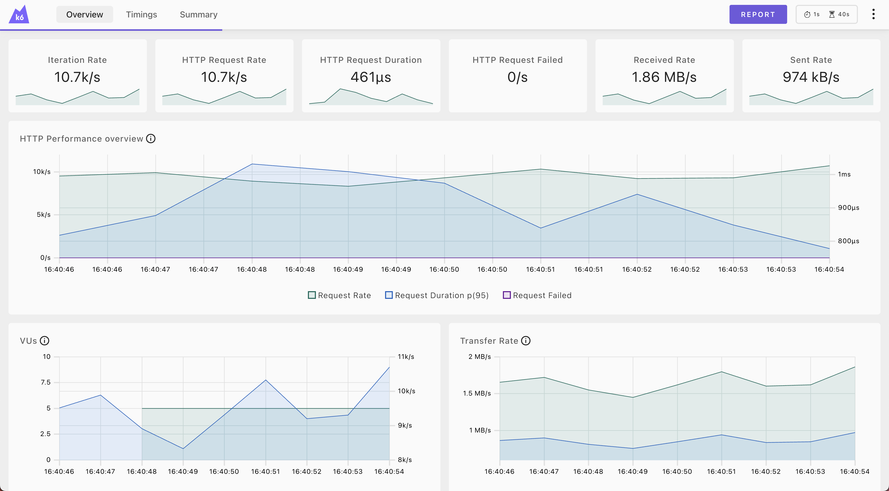
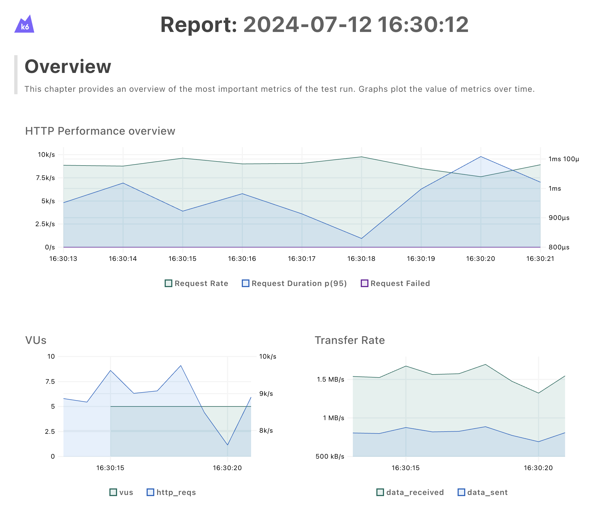

[k6](https://k6.io/)는 부하 테스트 툴 중에 사용성이나 성능, 필요 자원량 등이 다른 부하 테스트 툴과 비교하여 뛰어나다고 생각한다.
여기에 하나 부족한 것이 있다면, 시각화 된 결과를 보기까지의 설정이 번거롭다는 것이다.

그런데 올 초 릴리즈 된 [0.49 버전](https://github.com/grafana/k6/releases/tag/v0.49.0)에 Web Dashboard와 HTML로 된 Test report를 생성하는 기능이 추가되었다.

국내에는 Grafana를 이용한 시각화 방법만 소개가 되어있고, Web Dashboard, Test report를 사용하는 방법은 소개되지 않은 것 같아 실습 위주의 소개글을 작성하게 되었다.

## 실습 준비

- 실습을 위해서는 docker가 설치 되어 있어야 한다.
- 실습 코드는 MacOS 환경에서 테스트 되었다.

## 실습

### 테스트 대상 서버 기동

테스트를 위한 echo 서버를 기동한다.

```bash
docker run -p 5678:5678 --name http_echo --rm -d hashicorp/http-echo:1.0.0
```

### k6 스크립트 작성

script.js 파일을 만들고 아래의 내용을 파일에 작성한다.

```javascript
import http from "k6/http";

export let options = {
    vus: 5,          // 5개의 가상 사용자를 생성한다.
    duration: "10s", // 10초 동안 부하를 발생 시킨다.
}

export default function () {
    http.get("http://host.docker.internal:5678"); // 테스트 대상 서버로 GET 요청을 보낸다.
}

```

### k6로 부하 테스트 실행

script.js 파일이 있는 디렉토리에서 아래의 명령어를 실행하여 부하 테스트을 수행한다.

```bash
docker run \
	--rm \
	--add-host host.docker.internal:host-gateway \
	-v ./:/k6-dir \
	-p 5665:5665 \
	-e K6_WEB_DASHBOARD=true \
	-e K6_WEB_DASHBOARD_EXPORT=/k6-dir/report.html \
	-e K6_WEB_DASHBOARD_PERIOD=1s \
	grafana/k6:0.52.0 run /k6-dir/script.js
```

| 옵션                                             | 설명                                                         |
|------------------------------------------------|------------------------------------------------------------|
| --rm                                           | 부하테스트 종료 후 컨테이너를 삭제                                        |
| --add-host host.docker.internal:host-gateway   | container 내부에서 docker가 실행되는 호스트에 접근 가능하도록 설정               |
| -v ./:/k6-dir                                  | 명령어 실행 폴더를 container에 bind                                 |
| -p 5665:5665                                   | Web Dashboard 접속을 위해 container의 5665포트를 host의 5665포트로 bind |
| -e K6_WEB_DASHBOARD=true                       | Web Dashboard 기능을 활성화                                      |
| -e K6_WEB_DASHBOARD_EXPORT=/k6-dir/report.html | 부하 테스트 종료 후 Test report 작성 위치 설정                           |
| -e K6_WEB_DASHBOARD_PERIOD=1s                  | 부하 테스트 시, Test report용 데이터를 집계하는 주기 설정 (default 10s)       |

### Web Dashboard

부하 테스트 중에 [http://localhost:5665](http://localhost:5665)로 접속하면 테스트 결과를 바로바로 Dashboard를 통해 확인이 가능하다.
Dashboard에서 확인 가능한 정보는 전부 Test report에서도 확인 가능하다.

- 주의!!
    - 해당 페이지를 끄지 않으면 k6 테스트도 종료되지 않는다.



### Test report 확인

생성된 report.html 파일을 웹브라우저로 열어 Test report를 확인한다.



- Tip.
    - 그래프의 특정 범위를 드레그하면 그 부분만 확대가 되고, 그래프를 더블클릭하면 원 상태로 돌아간다.
    - 범례를 클릭하면 그래프에서 보일 범례를 조정하는 것이 가능하다.

### 테스트 환경 정리

테스트를 위해 기동했던 echo 서버를 종료 시킨다.

```bash
docker stop http_echo
```

## 마무리

k6의 Web Dashboard와 Test report를 이용해 간단히 시각화된 부하 테스트 결과를 얻는 실습을 진행했다.

더 자세한 사항은 [k6 Web dashboard](https://grafana.com/docs/k6/v0.52.x/results-output/web-dashboard/) 페이지를 참고하길 바란다.
