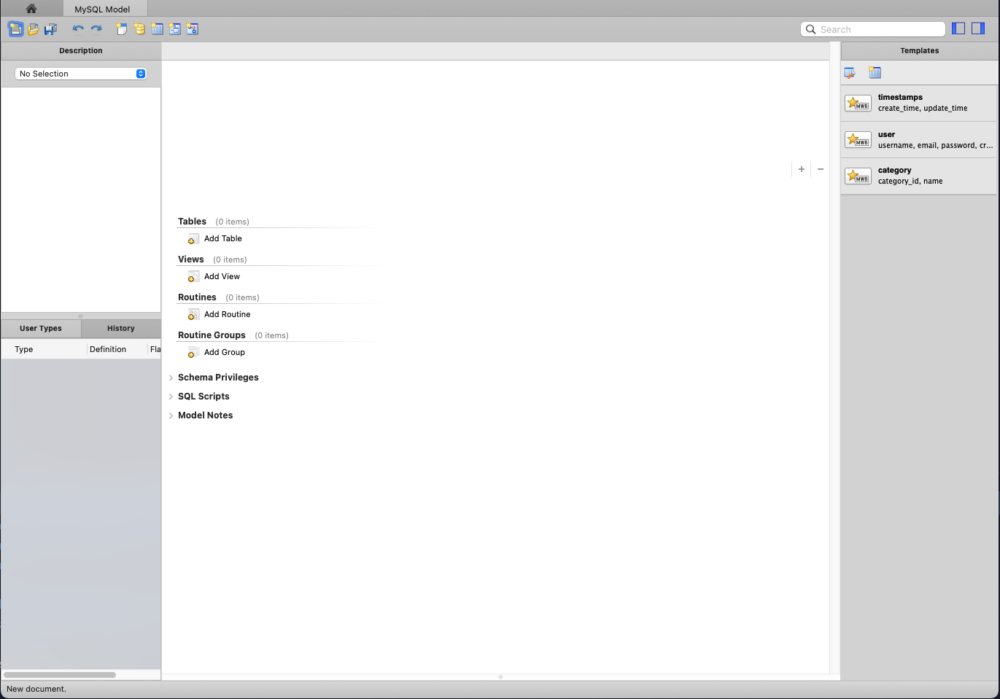
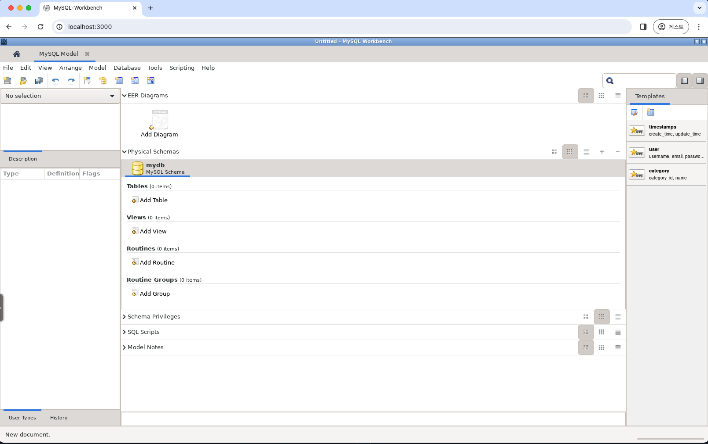
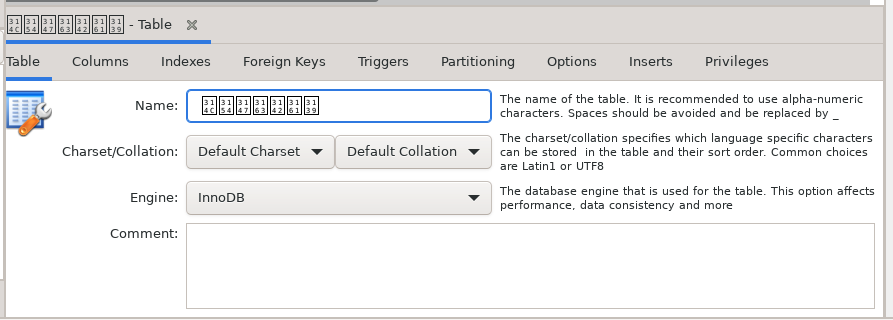
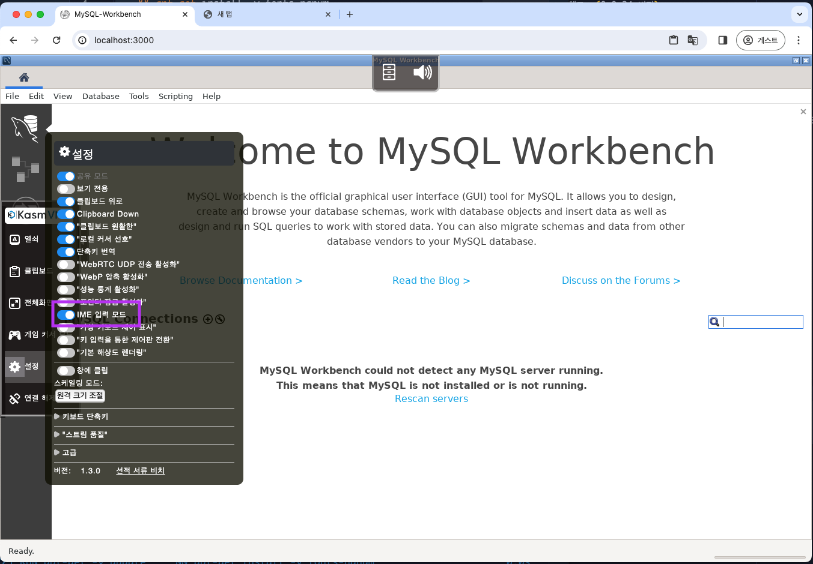
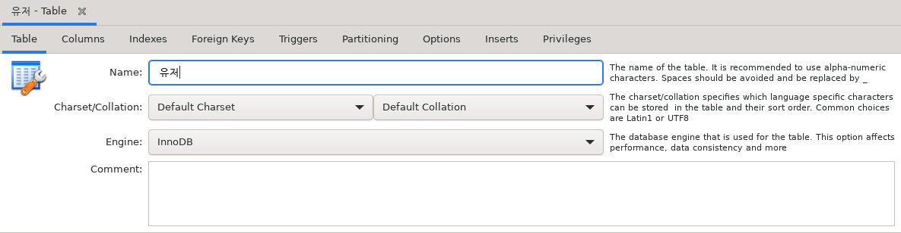

## TL;DR

1. [mysqlworkbench-on-docker 예제](https://github.com/seungyeop-lee/blog-example/tree/main/mysqlworkbench-on-docker)를 다운로드한다.
2. `make up` 명령어를 실행한다.
3. 웹 브라우저에서 `http://localhost:3000`으로 접속하여, MySQL Workbench를 사용한다.
4. 사용이 끝나면 `make down` 명령어를 실행하여 컨테이너를 종료한다.

## 발단

MySQL Workbench는 GUI 기반의 MySQL 관리 툴이다. 여기에는 ERD를 그리는 기능도 포함되어 있다.
무료로 사용 할 수있는 여러 ERD Tool을 비교했을 때, MySQL Workbench의 ERD가 가장 편리하다고 생각한다.

그러나, MacOS Sonoma 업데이트 후에 MySQL Workbench에서 ERD 모델을 열려고하면 강제종료 되는 문제가 발생했고, (8.0.34 버전)
2024년 01월 24일 현재 최신 버전인 8.0.36을 설치하여 사용 할 경우에도, 다음과 같은 문제가 발생한다.

- 부분적으로 UI가 표시되지 않음
- 간혈적으로 프로그램이 강제 종료 됨



이러한 문제가 언제 고쳐질지 알 수 없고, 이번처럼 운영체제 업데이트로 인한 이슈가 언제 또 발생 할 지 모르지만 다른 대안이 없기 때문에 MacOS에서 MySQL Workbench를 안정적으로 실행 할 수 있는 대안을 찾기 시작했다. 

## Docker로 MySQL Workbench 실행시키기

[linuxserver/mysql-workbench](https://docs.linuxserver.io/images/docker-mysql-workbench/)를 발견하였다. 
linuxserver라는 Docker를 통해 linux 어플리케이션을 실행시킬 수 있게 이미지화하는 작업을 전문적으로 하는 그룹에서 만든 이미지이다.

문서에 나와있는대로 따라하면 간단히 MySQL Workbench 컨테이너를 띄우고, 접속 할 수 있다.



하지만 한글이 입력되지 않는다는 문제가 있었다.



## 한글 입출력 문제 대응

해당이미지에 한글 폰트가 없어서 생기는 문제로 보고 기존 이미지에 한글 폰트를 추가하는 Dockerfile을 작성하여 사용하였다.

```dockerfile
FROM lscr.io/linuxserver/mysql-workbench:8.0.36

RUN apt-get -y update \
    && apt-get install -y fonts-nanum
```

그리고 IME 입력을 활성화 시켜준다. (활성화하지 않으면 자모 분리가 일어남)



테스트를 해보면 한글입력이 잘 되는 것을 확인 할 수 있다.



## 결론

이제 MacOS에서 걱정없이 MySQL Workbench 사용이 가능해졌다!

바로 실행 가능한 설정 파일은 [mysqlworkbench-on-docker 예제](https://github.com/seungyeop-lee/blog-example/tree/main/mysqlworkbench-on-docker)를 참고하기 바란다.
