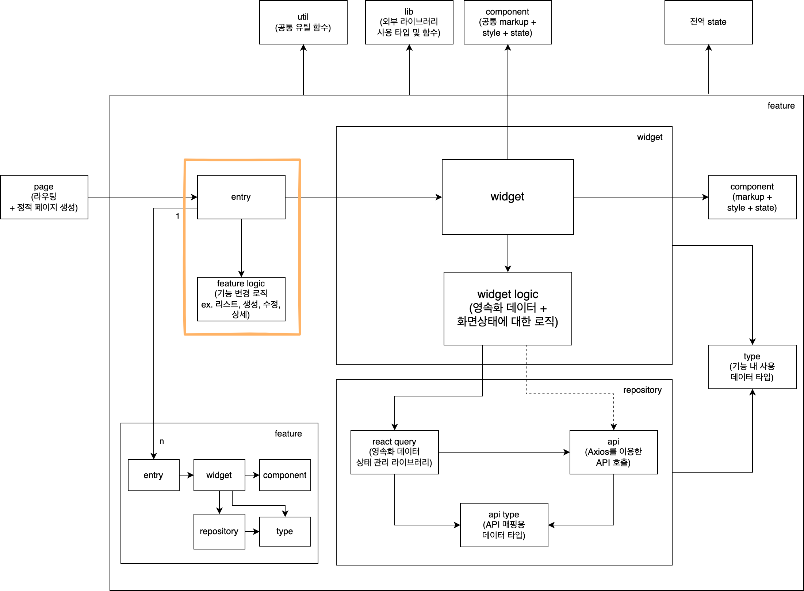
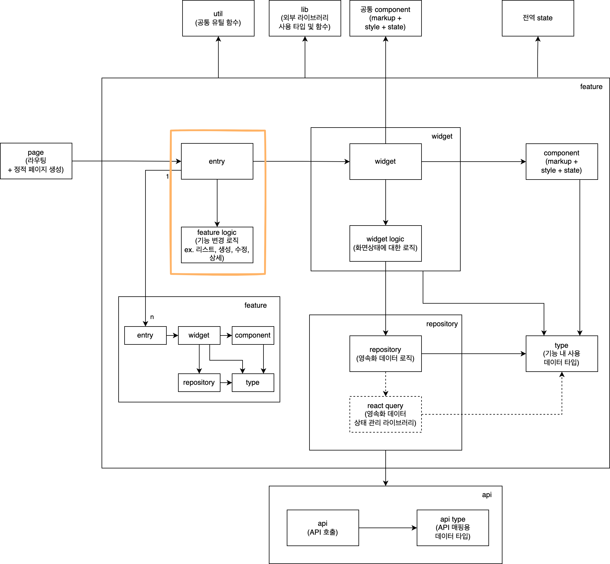

Next.js에서 사용 가능한 React 표준(범용) 아키텍처를 고민 할 일이 생겨서 여기에 그 과정을 정리한다. 

아키텍처는 아직 완성되지 않았다고 생각하며, 개선점이 나올 때마다 이 글에 업데이트 할 예정이다.

(**이 글을 참고하여 저작물을 생산하시는 경우, 출처를 남겨주시길 부탁드리겠습니다.**)

## 기본 설계 방향

- 각 요소의 역할이 뚜렷하고 중복되지 않도록한다.
- 의존관계가 순환하지 않도록한다.

## version1

[위젯 주도 개발][1]이라는 글에서 힌트를 얻어 기본적인 역할 별로 요소를 나누고 서로의 의존관계를 설정하였다.

- **pages**: routing에 대한 책임을 갖는다. nextjs의 특성상 pages폴더의 구조가 routing rule이므로 단순히 해당 page에 해당하는 widget을 호출하는 역할 만 수행한다.
- **widgets**: 특정 페이지에서 사용되는 complex component를 조합하는 책임을 갖는다. query를 사용해 페이지 내 공통 데이터 관리 및 complex component 사이의 연결 책임도 수행한다.
- **components**
    - **complex**: base component를 조합하고, 연결하는 책임을 갖는다. query를 사용해 기능 내 데이터 관리를 수행한다.
    - **base**: 화면에 보여지는 markup & css를 담당한다. view에 대한 책임을 갖는다.
- **queries**: 데이터 상태를 관리한다. 주로 API 서버와 통신하는 역할을 한다.

## version2

[version1](#version1)의 구조를 바탕으로 각 역할에 대해 좀 더 드릴 다운하였다.

- 이하를 제외하고는 [version1](#version1)과 상동
- **widgets**
  - **widget**: 특정 페이지의 layout 및 complext component를 조합한다.
  - **hook**: 영속화 데이터 로직을 책임진다. query를 이용해 데이터를 다룬다.
  - **css**: layout에 필요한 스타일을 정의한다.
- **components**
    - **complex**
      - **component**: base component를 조합하고, 배치한다.
      - **hook**: UI 로직을 책임진다. 
      - **store**: complex component의 내부 상태를 관리한다.
      - **css**: complex component에 필요한 스타일을 정의한다.
    - **base**
      - **component**: 더 기본적인 base component의 조합 및 markup을 담당한다.
      - **css**: base component에 필요한 스타일을 정의한다.
- **queries**
  - **query**: 서버에서 받은 데이터를 상태로서 관리한다.
  - **data**: 서버에서 받은 데이터이다.
  - **util func**: 서버에서 받은 데이터를 해석하여 기능을 제공해주는 함수 집합이다.

## version3

[version2](#version2)의 의존관계가 명료하지 않고, 역할이 중복된 느낌을 받아 전체적인 리팩토링이 필요하다고 판단하였다. 

widget의 모음을 나타내는 단어로서 [Bulletproof React][2] 레포지토리에서 사용된 feature(기능)라는 용어를 차용하여 아키텍처를 재구성하였다.

기능을 계층적으로 세분화하여 만드는 경우를 고려하여 프랙털 구조를 갖도록 설계하였다.

- **page**: routing 및 static page를 생성한다. feature가 배치될 layout도 여기서 정해진다.
- **feature**: 하나의 기능을 나타내는 단위로, page에서 호출 될 때는 Header, LNB, GNB, Footer를 제외한 main 부분(contents 부분)을 의미한다. 
  - **entry**: feature를 호출하기위한 입구에 해당하는 요소, widget을 조합하고, feature mode에 따라 widget을 변경한다.
    - **feature logic**: feature mode관리, feature 내 공통 데이터 관리 등을 담당한다. 
  - **widget**: main 부분을 구성하는 소 기능을 담당한다.
    - **container**: data logic을 만들어서 presentation에 주입하는 역할을 한다.
      - **data logic**: 영속화 데이터 로직을 책임진다. react query를 이용하여 데이터를 다룬다.
      - **react query**: 영속화 데이터 상태 관리 라이브러리로서, API를 통해 받은 데이터를 관리한다.
    - **presentation**: 여러개의 component를 조합하고, ui logic을 이용해 각 component를 연결한다.
      - **ui logic**: ui 내부의 상태를 관리한다. zustand를 이용하여 상태를 저장, 조작한다.
      - **zustand**: 범용 상태 관리 라이브러리로서 상태와 로직을 응집성 높게 관리 할 수 있는 장점이 있다.
  - **api**: API호출의 역할을 갖는다.
  - **component**: 화면에 보여지는 markup & css를 담당한다. view에 대한 책임을 갖는다. 특정 상황에서는 스스로의 상태도 갖는다. (ex. form)
- **util**: 공통 유틸 함수 모음
- **lib**: 외부 라이브러리 wrapping 함수 모음
- **component**: 프로젝트의 공용 component
- **state**: 프로젝트 내 공통 데이터 상태 관리

## version4

영속화 데이터 상태 관리부분과 api 호출부분의 연관성이 높으므로 repository로 그룹화하였다.
그로인해 widget의 책임이 줄어들고, 역할이 더 명확해졌다. 
또한, repository부분을 mocking하는 것으로 서버부분의 구현이 없이도 화면개발이 용이해져 유연성이 향상되었다.

단순 API호출이 필요한 경우에는 react query를 통하지 않고, widget에서 바로 api호출이 가능하도록하였다.

zustand를 제외 함으로서, 상태관리를 구현자의 재량에 맡기도록하였다.

- 이하를 제외하고는 [version3](#version3)와 상동
- **feature**
    - **repository**: widget에서 사용할 데이터에 대한 CRUD의 책임을 갖는 요소
      - **react query**: widget에서 사용할 데이터의 상태를 관리한다.
      - **api**: react query 및 widget에서 직접 호출해서 사용할 API의 호출 역할을 갖는다.
      - **type**: 기능 내 사용 데이터 타입을 정의한다.

## version5

widget의 책임이 줄어듦으로서, container와 presentation, data logic과 ui logic으로 나눈 설계가 표준 아키텍처로 사용하기에는 과해 보였다.
([version4](#version4)로 만든 간단한 게시판에서 컬럼 1개를 삭제하는 작업을 했을 때, 수정해야하는 부분이 너무 많다고 느껴졌다.)

그래서 container와 presentation을 widget으로, data logic과 ui logic을 widget logic으로 통폐합하였다.

- 이하를 제외하고는 [version4](#version4)와 상동
- **feature**
    - **widget**
        - **widget**: main 부분을 구성하는 소 기능을 담당한다. component를 조합하고, widget logic을 이용해 각 component를 연결한다.
        - **widget logic**: 영속화 데이터 로직과 UI 로직을 담당한다.

## version6

widget에서 사용하는 데이터 타입과 api를 통해 전달되는 데이터의 형태가 다른 패턴이 발생 할 수 있음을 확인하였으므로 수정작업을 진행하였다.
(ex. 1개의 widget에서 사용하는 데이터가 2개 이상의 api를 조합하여 만들 필요가 있는 경우)

그래서 api 매핑용 데이터 타입 (api type)과 widget용 데이터 타입(type)으로 나누었다.

- 이하를 제외하고는 [version5](#version5)와 상동
- **feature**
    - **type**: widget에서 사용하는 데이터의 타입을 정의한다.
    - **repository**
      - **api type**: API를 통해 받은 데이터를 매핑하기 위한 타입을 정의한다.

## version7

version6를 실제로 사용해 보았을 때, widget logic이 react query가 제공하는 타입에 암묵적 의존하는 것을 확인하였다.
그로 인해, 서버가 아직 준비되어 있지 않아, mock 데이터를 우선 사용하여 화면작업을 해야하는 경우, 
주니어 개발자들이 많이 헤메는 현상을 확인하였다. 

이러한 어려움을 해소하고자, repository와 react query를 분리하는 수정작업을 진행하였다. 

또한 api type의 사용을 선택적으로 하도록 변경하였다.
(기본적으로 화면 전용 API를 서버에서 제공해주기로 내부 의사 결정이 일어난것에 따름)

- 이하를 제외하고는 [version6](#version6)와 상동
- **feature**
    - **repository**: widget에서 사용 할 데이터 핸들링을 담당한다. react query가 api type으로 데이터를 제공하는 경우, type 형태로 매핑하는 역할도 담당한다.
    - **query**
        - **react query**: API를 통해 받은 데이터의 상태를 관리한다.
        - **api**: react query에서 사용할 API의 호출 역할을 갖는다.
        - **api type**: API를 통해 받은 데이터를 매핑하기 위한 타입을 정의한다. API에서 주는 데이터와 widget에서 사용하는 type이 다를경우 사용한다.

## version8

서버에서 화면전용 API를 제공해주지 않고, 각 feature가 여러개의 API를 조합하여 사용해야하는 경우를 대비한 아키텍처이다.

범용 아키텍처를 지향하므로 react query 부분도 optional하게 변경하였다.

- 이하를 제외하고는 [version7](#version7)와 상동

- **feature**
    - **repository**: 
      - **repository**: widget에서 사용 할 데이터 핸들링을 담당한다. 
      - **react query**: n개의 API를 통해 받은 데이터의 상태를 통합하여 관리한다. api type을 type 형태로 매핑하는 역할도 담당한다.
    - **query**
        - **api**: 서버가 제공하는 API의 호출 역할을 갖는다.
        - **api type**: API를 통해 받은 데이터를 매핑하기 위한 타입을 정의한다.

## ref.

- [[번역] 위젯 주도 개발][1]
- [Bulletproof React][2]

[1]: <https://medium.com/@yujso66/%EB%B2%88%EC%97%AD-%EC%9C%84%EC%A0%AF-%EC%A3%BC%EB%8F%84-%EA%B0%9C%EB%B0%9C-b3e95b261c18> "[번역] 위젯 주도 개발"
[2]: <https://github.com/alan2207/bulletproof-react> "Bulletproof React"
