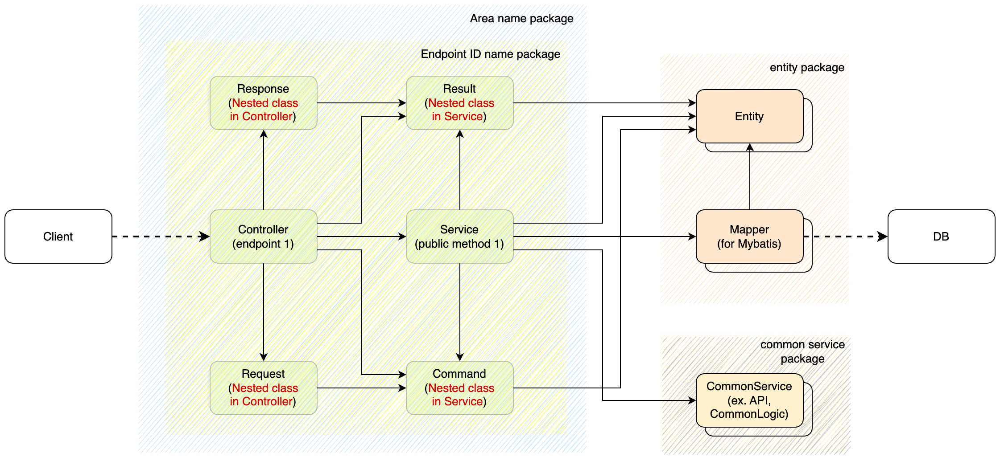

## 서론

회사의 새로운 솔루션에 사용 될 프로젝트의 스캐폴드 작성을 해달라는 요청이 있었는데,
이 기회에 개선된 내부 아키텍처를 제안드릴 겸, Spring MVC와 Mybatis 기반의 단순 아키텍처를 고안해보았다.

사내의 개발자분들이 일을 하는 방식, 배경지식을 고려하여 작성하였으나 비슷한 고민을 하는 다른 분들께 도움이 될 수도 있을 것 같아 글로 남겨본다.

이해를 돕기위해 간단한 생성, 조회 기능을 하는 예제를 같이 같이 작성해보았다.

여기에서 사용하는 모든 예제 코드는 [Github Repository](https://github.com/seungyeop-lee/blog-example/tree/main/architecture-in-spring/modules)에서 확인 가능하다.

## AS-IS

### 구성도


사내에서 지금까지 진행된 프로젝트는 전형적인 Controller-Service-Mapper 구조를 가지고 있고,
계층별 통신에 사용되는 데이터는 Map<String, Object>를 이용하고 있었다.

### 예제 코드

회사 코드를 사용 할 수는 없어서, 회사에서 일반적으로 사용하는 패턴을 따라서 작성해 보았다.

```java
@RestController
@RequiredArgsConstructor
public class BookController {

    private final BookService bookService;

    /**
     * EXAM001
     */
    @PostMapping("/createBook")
    public Map<String, Object> createBook(@RequestBody Map<String, Object> data) {
        return bookService.create(data);
    }

    ...
}
```

Controller는 매핑된 경로로 들어온 요청에 맞는 service의 메서드를 호출하는 역할 만 한다.

뭐든 담을 수 있는 Map을 요청, 응답의 데이터를 담는 그릇으로 사용하다보니 자연스럽게 Controller의 역할이 줄어든 것으로 보인다.

```java
@Service
@Transactional
@RequiredArgsConstructor
public class BookService {

    private final BookMapper mapper;

    public Map<String, Object> create(Map<String, Object> data) {
        // 필수 값 확인
        if (data.get("title") == null ||
                data.get("isbn") == null ||
                data.get("publishedDate") == null
        ) {
            Map<String, Object> response = new HashMap<>();
            response.put("resultCode", "0001");
            response.put("resultMessage", "필수 값이 누락되었습니다.");
            return response;
        }

        // ISBN 중복 확인
        Map<String, Object> book = mapper.readByIsbn(data.get("isbn").toString());
        if (book != null) {
            Map<String, Object> response = new HashMap<>();
            response.put("resultCode", "0002");
            response.put("resultMessage", "동일한 ISBN으로 등록 된 책이 있습니다.");
            return response;
        }

        // 책 생성
        mapper.create(data);

        // 응답 결과 적용
        data.put("bookId", Long.parseLong(data.get("bookId").toString()));
        data.put("resultCode", "0000");
        data.put("resultMessage", "정상 처리 되었습니다.");

        return data;
    }

    ...
}
```

서비스의 메서드에 모든 로직 (유효성 검사, 비즈니스 로직, 응답 데이터 생성 등)이 존재한다.
각 세부 로직은 로직이 시작되는 부분에 주석으로 기능을 간단히 나타낸다.

파라미터와 반환값 모두 Map을 사용하고, 로직도 한 군데서 처리되다보니 Map의 재사용이 자연스러운 환경이었던걸로 보인다.

무분별한 Map 사용은 [깨진 유리창 이론](https://ko.wikipedia.org/wiki/%EA%B9%A8%EC%A7%84_%EC%9C%A0%EB%A6%AC%EC%B0%BD_%EC%9D%B4%EB%A1%A0)의 깨진 유리창과 같은 역할을 한다. 
구현을 빠르게 할 수 있는 만큼, 빠르게 레거시화 된다는 것이 내 생각이다.

## TO-BE v1

### 구성도


고안해본 구조의 핵심은 public method에서의 Map사용을 지양하는 것과 endpoint 별로 package를 나누는 것이다.

인터페이스 정의서를 작성 후 구현에 들어가는데, 인터페이스 정의서는 엑셀로 작성 및 관리되고, 1개의 endpoint 당 1개의 시트를 사용하여 작성된다.
각 endpoint는 고유한 ID (ex. EXAM001)을 가지고 있다.

그래서 각 endpoint의 ID를 기준으로 Controller를 나누고, Controller의 중첩 클래스로서 요청, 응답의 형태를 정의하여 사용하는 것으로 인터페이스 정의서와 매칭하여 관리하기 용이하도록 구성하였다.

### 예제 코드

Mapper와 Entity는 [Mybatis Generator](https://mybatis.org/generator/)로 생성된 것을 사용하였다.

```java
@RestController
@RequiredArgsConstructor
public class EXAM001Controller {

    private final EXAM001Service service;

    @PostMapping("/createBook")
    public Response createBook(@RequestBody Request request) {
        request.validate();

        DataManager dataManager = new DataManager(request);

        service.createBook(dataManager);

        return dataManager.buildResponse();
    }

    @Data
    static class Request {
        private String title;
        private String isbn;
        private LocalDate publishedDate;

        public void validate() {
            if (title == null || isbn == null || publishedDate == null) {
                throw new RequiredValueException();
            }
        }
    }

    @Getter
    static class Response extends BaseApiResponse {
        private Long bookId;
        private String title;
        private String isbn;
        private LocalDate publishedDate;

        public static Response of(
                Long bookId,
                String title,
                String isbn,
                LocalDate publishedDate
        ) {
            Response response = new Response();
            response.bookId = bookId;
            response.title = title;
            response.isbn = isbn;
            response.publishedDate = publishedDate;
            response.markOk();
            return response;
        }
    }
}
```

Controller에 endpoint 1개만 정의하였고, endpoint에서 사용되는 요청 데이터와 응답 데이터의 형식을 중첩클래스로 작성하였다.

덕분에 인터페이스 정의서와 코드를 모니터 양 옆에 띄어놓고 확인하기가 수월해졌다.

또한 요청 자체에 대한 유효성 검사는 요청 클래스에서 하도록 함으로서 응집도를 높였다.

```java
@Service
@Transactional
@RequiredArgsConstructor
class EXAM001Service {

    private final BookMapper bookMapper;

    public void createBook(DataManager dataManager) {
        checkIsbnDuplication(dataManager);

        Book book = dataManager.bookForInsert();
        bookMapper.insert(book);

        dataManager.setBook(book);
    }

    private void checkIsbnDuplication(DataManager dataManager) {
        BookExample example = new BookExample();
        example.createCriteria().andIsbnEqualTo(dataManager.getIsbn());

        List<Book> books = bookMapper.selectByExample(example);
        if (!books.isEmpty()) {
            throw new Exceptions.ISBNDuplicationException();
        }
    }
}
```

Service는 비즈니스 로직에 집중 할 수 있게 구성하였다. 

ISBN 중복 검사부분은 Mybatis Generator로 생성한 Mapper를 사용해서 가독성은 줄어들었다.

하지만 형 안전성을 얻었고, private 메서드를 이용하면 충분히 유지보수성을 유지 할 수 있을 것이라 생각한다.

```java
@RequiredArgsConstructor
class DataManager {

    private final EXAM001Controller.Request request;
    private Book book;

    public String getIsbn() {
        return request.getIsbn();
    }

    public Book bookForInsert() {
        Book book = new Book();
        book.setTitle(request.getTitle());
        book.setIsbn(request.getIsbn());
        book.setPublishedDate(request.getPublishedDate());
        return book;
    }

    public void setBook(Book book) {
        this.book = book;
    }

    public EXAM001Controller.Response buildResponse() {
        return EXAM001Controller.Response.of(
                book.getBookId(),
                book.getTitle(),
                book.getIsbn(),
                book.getPublishedDate()
        );
    }
}
```

타입을 적극적으로 도입하다보면 타입 전환 및 생성 코드가 필요하게 되는데, 
이러한 코드는 Controller와 Service 어디에도 어울리지 않는다.
그래서 이러한 일을 전담하는 DataManager라는 클래스를 도입하였다.

개인적으로는 Service계층을 위한 전용 타입이 있어야 하고, 의존성 방향에 맞춰서 의존하는 쪽 계층에서 타입 전환 및 생성 책임을 가져야한다고 생각하지만, 
인터페이스와 DB설계가 먼저 다 완료되고, 마지막으로 서비스 계층의 설계 및 구현이 되는 조직의 특성상 이러한 형태가 좀 더 실리적이라고 생각한다.

## TO-BE v2

회사에서 v1을 도입하여 작업한 결과, DataManager가 가독성을 저하시키는 요인으로 작용 할 여지가 크게 보임에 따라 아키텍처를 수정하였다.

### 구성도



DataManager를 제거하고, Service계층을 위한 전용 타입인 Command와 Result를 추가하였다.

### 예제 코드

```java
@RestController
@RequiredArgsConstructor
public class EXAM001Controller {

    private final EXAM001Service service;

    @PostMapping("/createBook")
    public Response createBook(@RequestBody Request request) {
        request.validate();

        EXAM001Service.Result result = service.createBook(request.toCommand());

        return Response.from(result);
    }

    @Data
    static class Request {
        private String title;
        private String isbn;
        private LocalDate publishedDate;

        public void validate() {
            if (title == null || isbn == null || publishedDate == null) {
                throw new RequiredValueException();
            }
        }

        public EXAM001Service.Command toCommand() {
            return EXAM001Service.Command.of(title, isbn, publishedDate);
        }
    }

    @Getter
    static class Response extends BaseApiResponse {
        private Long bookId;
        private String title;
        private String isbn;
        private LocalDate publishedDate;

        public static Response from(EXAM001Service.Result result) {
            Response response = new Response();
            response.bookId = result.getBookId();
            response.title = result.getTitle();
            response.isbn = result.getIsbn();
            response.publishedDate = result.getPublishedDate();
            response.markOk();
            return response;
        }
    }
}
```

Request는 Command 객체를 생성하는 책임이 추가되었고, Response는 Result로 부터 스스로를 생성 할 책임이 추가되었다. 

```java
@Service
@Transactional
@RequiredArgsConstructor
class EXAM001Service {

    private final BookMapper bookMapper;

    public Result createBook(Command command) {
        checkIsbnDuplication(command);

        Book book = command.bookForInsert();
        bookMapper.insert(book);

        return Result.from(book);
    }

    private void checkIsbnDuplication(Command command) {
        BookExample example = new BookExample();
        example.createCriteria().andIsbnEqualTo(command.getIsbn());

        List<Book> books = bookMapper.selectByExample(example);
        if (!books.isEmpty()) {
            throw new Exceptions.ISBNDuplicationException();
        }
    }

    @Getter
    static class Command {
        private String title;
        private String isbn;
        private LocalDate publishedDate;

        public static Command of(
                String title,
                String isbn,
                LocalDate publishedDate
        ) {
            Command command = new Command();
            command.title = title;
            command.isbn = isbn;
            command.publishedDate = publishedDate;
            return command;
        }

        public Book bookForInsert() {
            Book book = new Book();
            book.setTitle(title);
            book.setIsbn(isbn);
            book.setPublishedDate(publishedDate);
            return book;
        }
    }

    @Getter
    static class Result {
        private Long bookId;
        private String title;
        private String isbn;
        private LocalDate publishedDate;

        public static Result from(Book book) {
            Result result = new Result();
            result.bookId = book.getBookId();
            result.title = book.getTitle();
            result.isbn = book.getIsbn();
            result.publishedDate = book.getPublishedDate();
            return result;
        }
    }
}
```

서비스 메서드의 파라미터는 Command, 반환 값은 Result로 변경되었다. 이로인해 서비스 메서드에 어떤 데이터가 필요하고, 실행 결과 어떤 데이터가 반환되는지 확인하기 용이해졌다.

Command는 Mapper에서 사용 할 객체를 생성하는 책임이 추가되었고, Result는 Entity로부터 스스로를 생성 할 책임이 추가되었다.

Controller의 Request와 Service의 Command, Controller의 Response와 Service의 Result가 중복으로 보일 수 있으나 내 생각에는 **우발적 중복**이라 생각한다. (해당 내용은 클린 아키텍처 "16장.독립성#중복" 부분을 참고)
